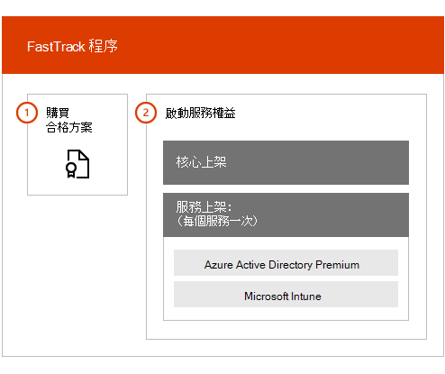

# FastTrack 中心權益概觀FastTrack Center Benefit Overview

若擁有 Microsoft Azure Active Directory 進階版、Microsoft Intune 和 Azure 資訊保護的 FastTrack 中心權益，您就可以透過遠端方式與 FastTrack 專家合作，預備您的環境以供使用，並規劃在組織內的推行與使用。With FastTrack Center Benefit for Microsoft Azure Active Directory Premium, Microsoft Intune, and Azure Information Protection, you work remotely with FastTrack Specialists to get your environment ready for use and to plan the rollout and usage within your organization. 若要深入了解符合資格，請參閱[適用於 Enterprise Mobility + Security (EMS) 的 FastTrack 中心權益程序](EMS-fasttrack-process.md)。To learn more about eligibility, see [FastTrack Center Benefit Process for Enterprise Mobility + Security (EMS)](EMS-fasttrack-process.md).

「上架」有兩個主要元件：Onboarding has two major components:

-   **核心上架** - 租用戶組態和與 Azure Active Directory 整合 (若有需要) 所需的工作。**Core onboarding** - Tasks required for tenant configuration and integration with Azure Active Directory, if needed. 核心上架也能成為將其他符合 Microsoft Online 資格之服務上架的基準。Core onboarding also provides the baseline for onboarding other Microsoft Online eligible services.

-   **服務上架** - 設定 EMS 工作負載的任何獨立變體 (Azure AD 進階版、Intune 和 Azure 資訊保護) 所需的工作。**Service onboarding** - Tasks required to configure any of the standalone variants of the EMS workload (Azure AD Premium, Intune, and Azure Information Protection).

下圖說明 FastTrack 中心權益的高階上架階段。The following diagram describes the high-level onboarding phases for the the FastTrack Center Benefit.

以下是程序的運作方式：Here's how the process works:

- 在您購買合格服務的授權之後，FastTrack 中心會嘗試連絡您以提供上架協助。The FastTrack Center tries to contact you to offer onboarding assistance after you purchase licenses of an eligible service. 如果您已準備好要將這些服務部署到組織中，也可以從 [FastTrack 中心](https://go.microsoft.com/fwlink/?linkid=780698)要求協助。You can also request assistance from the [FastTrack Center](https://go.microsoft.com/fwlink/?linkid=780698) if you're ready to deploy these services for your organization. 若要要求協助，請使用公司或學校帳戶登入 [FastTrack 中心](https://go.microsoft.com/fwlink/?linkid=780698)、前往儀表板、展開頁面右下角的 [需要協助嗎？]\*\*\*\* 連結，然後依照提示完成您的要求。To request assistance, sign in to the [FastTrack Center](https://go.microsoft.com/fwlink/?linkid=780698) with your work or school account, go to the dashboard, expand the **Need Help?** link at the lower-right corner of the page, and then follow the prompts to complete your request. 上架開始後，我們將安排線上會議的時間。Once onboarding starts, we’ll set up a schedule of online meetings.

-   FastTrack 團隊會先幫助您上架核心功能 (所有 Microsoft Online 服務的共同功能)，然後再上架個別合格服務。The FastTrack team helps you first with core capabilities (common for all Microsoft Online Services) and then with onboarding each eligible service.

所有上架指導皆由專門的 FastTrack 人員從遠端進行：All onboarding guidance is provided remotely by assigned FastTrack personnel:

-   FastTrack 將透過遠端方式搭配使用各項工具、文件和指引來協助您進行不同的上架活動。The FastTrack team remotely assists you with various onboarding activities by using a combination of tools, documentation, and guidance.

-   上架指導由 FastTrack 中心提供，在指定地區的正常上班時間內提供。Onboarding guidance is provided by the FastTrack Center, and is available during normal business hours for a given region.

-   上架協助提供的語言有：繁體中文、簡體中文 (僅說中文的資源)、英文、法文、德文、義大利文、日文、韓文、葡萄牙文 (巴西)、西班牙文、泰文以及越南文。Onboarding assistance is available in Traditional Chinese, Simplified Chinese (resources speak Mandarin only), English, French, German, Italian, Japanese, Korean, Portuguese (Brazil), Spanish, Thai, and Vietnamese.

-   FastTrack 團隊可直接與您或您的代表配合。The FastTrack team can work directly with you or your representative.

> [!NOTE]
> **想要深入了解？** 請參閱 [Enterprise Mobility + Security](https://www.microsoft.com/cloud-platform/enterprise-mobility)。**Want to learn more?** see [Enterprise Mobility + Security](https://www.microsoft.com/cloud-platform/enterprise-mobility).

## 後續步驟Next steps

[適用於 EMS 的 FastTrack 中心權益 - 來源環境期待FastTrack Center benefit for EMS - Source environment expectations](EMS-source-environment-expectations.md)
