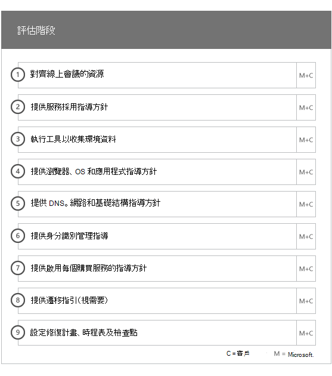
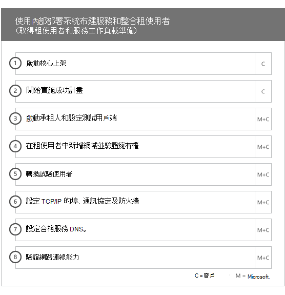
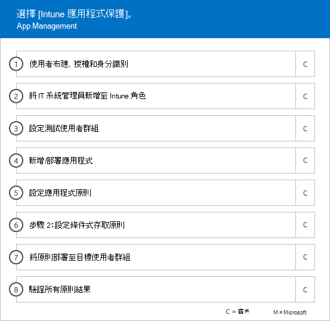

# 上線階段

使用 [合格服務與計劃](M365-eligible-services-and-plans.md) 使 Microsoft Azure Active Directory Premium、Microsoft Intune 和 Azure 資訊保護就緒時，程序中包含數個階段。 以下幾節說明上線程序的每個階段。

上線有四個主要階段：

## 起始階段

購買適當數量的授權之後，請遵循購買確認電子郵件中的指示，將授權與您現有或新租用戶產生關聯。 Microsoft 便會驗證您的 FastTrack 中心權益資格，並嘗試與您連絡以提供上線協助。

> [!NOTE]
> 如果您已準備好為組織部署這些服務，也可以從 [FastTrack 中心](https://go.microsoft.com/fwlink/?linkid=780698)要求協助。

### 若要要求協助

1. 登入 [FastTrack 網站](https://go.microsoft.com/fwlink/?linkid=780698)。
2. 從您的登陸頁面頂端的 [快速動作]**** 選取 [要求協助使用 Microsoft 365]****，或選取部署卡片上的 [要求協助使用 Microsoft 365]****。
3. 填妥 [要求協助使用 Microsoft 365]**** 表單。

一旦上線支援啟動，我們將設定線上會議的排程。

Microsoft 合作夥伴也可以透過 [FastTrack 網站](https://go.microsoft.com/fwlink/?linkid=780698)代表客戶取得協助。 若要這麼做︰

1. 登入 [FastTrack 網站](https://go.microsoft.com/fwlink/?linkid=780698)。
2. 選取 **[我的客戶]**。
3. 搜尋您的客戶或從客戶清單中選取他們。
4. 選取 [服務]****。
5. 填妥 [要求協助使用 Microsoft 365]**** 表單。

一旦上線支援啟動，FastTrack 將設定與您進行的線上會議排程，以討論上線程序、 驗證資料及設定專案啟動會議。

## 評估階段

一旦上線程序開始，FastTrack 中心將配合您評估您的來源環境和需求。 我們會執行工具來評估您的環境，FastTrack 專家會引導您評估內部部署 Active Directory、網際網路瀏覽器、用戶端裝置作業系統、網域名稱系統 (DNS)、網路、基礎結構和身分識別系統，以判斷針對上線是否需要進行任何變更。

FastTrack 中心也會提供如何驅動成功採用合格服務的相關指引。

根據您目前的設定，我們將提供修復方案，該方案最高可將您的來源環境帶至成功上線為 EMS 或其個別雲端服務的最低系統需求。 我們也會對修復階段設定適當的檢查點通話。

## 修復階段
請在來源環境中執行修復方案中的工作，使您能夠符合將每項服務上線和採用的需求 (視需要)。

開始「啟用」階段之前，我們會一起驗證修復活動的成果，以確定您已準備就緒可繼續進行。

## 啟用階段
當所有修復活動都完成時，專案會轉為設定服務取用的核心基礎結構，以及佈建每個合格 EMS 雲端服務。

**啟用階段 - 核心功能**

核心上線包括服務佈建和租用戶與身分識別整合。 其中也包括提供 Azure AD Premium、Intune 和 Azure 資訊保護等上線線上服務基礎的步驟。

> [!NOTE]
> WAP 代表 Web 應用程式 Proxy。SSL 代表安全通訊端層。SDS 代表學校資料同步處理。有關 SDS 的詳細資訊，請參閱[歡迎使用 Microsoft 學校資料同步處理](https://go.microsoft.com/fwlink/?linkid=871480)。

> [!NOTE]
> 受管理的驗證方法包括但不限於密碼雜湊同步處理。 身分識別整合為一次性活動，而且不包括移轉或解除委任現有的驗證方法，例如受管理的驗證或同盟驗證。

### 啟用階段 - Azure AD Premium

Azure AD Premium 環境可以使用 Azure Active Directory Connect 工具目錄同步處理與 Active Directory Federation Services (AD FS) 進行設定 (視需要)。

針對包含同步處理內部部署雲端身分識別的 Azure AD Premium 案例，我們會協助將 IT 系統管理員和使用者新增至您的訂用帳戶、設定管理必要條件、設定 Azure AD Premium、使用受管理的驗證設定目錄同步處理、使用 Azure AD Connect 工具設定 AD FS、設定測試使用者，並針對服務驗證您的核心使用案例。

Azure AD Premium 設定包括啟用下列功能：

-   Azure Active Directory 自助式密碼重設 (SSPR)。

-   Azure Multi-Factor Authentication (Azure MFA)。

-   從 [Azure Active Directory Marketplace](https://azure.microsoft.com/marketplace/active-directory/)，最多三個 (3) 或多個軟體即服務 (SaaS) 應用程式與單一登入 (SSO) 整合。

-   使用者自動佈建預先整合的 SaaS 應用程式 (如[應用程式整合教學課程清單](https://docs.microsoft.com/azure/active-directory/saas-apps/tutorial-list)所列) 僅限於向外佈建。

-   自訂登入畫面，包括商標、文字和影像。

-   自助式群組及動態群組 (群組)。

-   Azure Active Directory 應用程式 Proxy。

-   Azure Active Directory Connect Health。

-   Azure Active Directory 條件式存取。

-   Azure Active Directory 使用規定。

-   Azure Active Directory Identity Protection。

-   Azure Active Directory Privileged Identity Management。

-   Azure Active Directory 存取權檢閱。

-   Azure Active Directory 密碼保護。

-   Azure Active Directory B2B。

### 啟用階段 - Intune

針對 Intune，我們會逐步引導您將 Microsoft Intune 就緒以管理裝置。 確切的步驟取決於您的來源環境，而且是根據您的行動裝置和行動裝置應用程式管理需求。 步驟可能包括：

-   授權使用者。 我們也會提供有關如何為 Microsoft 雲端服務租用戶啟用大量授權的協助 (視需要)。

-   利用內部部署 Active Directory 或雲端身分識別設定 Intune 所使用的身分識別。

-   將使用者新增到您的 Intune 訂用帳戶、定義 IT 系統管理員角色，以及建立使用者和裝置群組。

-   根據您的管理需求，設定行動裝置管理 (MDM) 授權單位，包括：

    -   當 Intune 為您唯一的 MDM 解決方案時，將 Intune 設定為 MDM 授權單位。

-   為下列提供 MDM 指引：

    -   設定用於驗證 MDM 管理原則的測試群組。

    -   設定 MDM 管理原則和服務，例如：

        -   透過網頁連結或深層連結，針對每個支援的平台進行應用程式部署。

        -   條件式存取原則。

        -   部署電子郵件、無線網路和虛擬私人網路 (VPN) 設定檔 (如果貴組織中有現有的憑證授權單位、Wi-Fi 或 VPN 基礎結構)。

        -   設定 Microsoft Intune Exchange Connector (如果適用)。

        -   連線到 Intune 資料倉儲

        -   整合 Intune 與：
            -   用於遠端協助的 Team Viewer (需要有 Team Viewer 訂用帳戶)。

            -   Mobile Threat Defense (MTD) 合作夥伴解決方案 (需要有 Mobile Threat Defense 訂用帳戶)。

            -   電信費用管理解決方案 (需要有電信費用管理解決方案訂用帳戶)。

            -   Microsoft Defender 進階威脅防護 (需要有 Windows E5 或 Microsoft 365 E5 授權)。

    -   將每個[支援的平台](https://technet.microsoft.com/library/dn600287.aspx)的裝置註冊到 Intune。

-   為下列提供「應用程式保護」指引：

    -   針對每個支援的平台設定應用程式保護原則。

    -   為受管理的應用程式設定條件式存取原則。

    -   使用上述 MAM 原則鎖定適當的使用者群組。

    -   使用受管理的應用程式使用報告。

-   為下列提供電腦管理指引：

    -   安裝 Intune 用戶端軟體 (視需要)。

    -   使用 Intune 中可用的軟體和硬體報告。

    > [!IMPORTANT]
    > FastTrack 不支援 Windows 10 傳統電腦管理搭配 Intune。 FastTrack 僅透過 Intune 行動裝置管理 (MDM) 支援 Windows 10 裝置管理。

#### Windows Autopilot

FastTrack 可協助您以 Windows Autopilot 和 Intune 簡化裝置佈建，透過提供新裝置給使用者，不需建置、維護及將自訂的作業系統映像套用到您的裝置。

FastTrack 支援下列 Autopilot 案例：

- **Azure AD 自助：** 裝置加入 Azure AD 並註冊到 Intune。 使用 Windows 10 1703 和最新版本時，支援此案例。

- **混合式 AAD 自助：** 裝置加入內部部署 AD 和 Azure AD，並註冊到 Intune。 使用 Windows 10 1809 和最新版本時，支援此案例。

- **自行佈建：** 裝置自動加入 Azure AD。 使用 Windows 1809 和最新版本時，支援此案例。

    > [!IMPORTANT]
    > FastTrack 不支援 Configuration Manager 起始的 Autopilot 案例。

設定 Windows Autopilot 的步驟取決於您的來源環境，而且可能包括：

- 設定並安裝 Windows Autopilot 適用的 Microsoft Intune。

- 設定 Azure AD 動態群組

- 將公司商標新增至 Azure AD。

- 建立裝置並將其指派至 Windows Autopilot 設定檔 (例如，限制本機系統管理員帳戶建立的 Windows Autopilot 設定檔)。

- 自訂全新體驗 (OOBE)，以符合組織的需求。

- 在 Azure AD 和 Intune 中設定 MDM 自動註冊。

#### 安全地部署 iOS 版和 Android 版 Outlook

FastTrack 可協助您在組織內安全地部署 iOS 版和 Android 版 Outlook，以確保您的使用者安裝所有必要應用程式。

使用 Intune 安全地部署 iOS 版和 Android 版 Outlook Mobile 的步驟取決於您的來源環境，而且可能包括：

- 經由 Apple App Store 或 Google Play 商店下載 iOS 版和 Android 版 Outlook、Microsoft Authenticator 和 Intune 公司入口網站應用程式。
- 並提供以下設定的相關指引：
    - iOS 版和 Android 版 Outlook、Microsoft Authenticator 和 Intune 的 Intune 公司入口網站應用程式部署。
    - 應用程式保護原則
    - 條件式存取原則
    - 應用程式組態原則

    > [!IMPORTANT]
    > FastTrack 小組不支援使用 Exchange 行動裝置信箱原則保護 iOS 版和 Android 版 Outlook。

#### 雲端附加

FastTrack 會引導您使用 Intune 針對現有的 Configuration Manager 環境進行雲端附加。 確切的步驟取決於您的來源環境。 這些步驟可能包括：

- 說明雲端附加 Configuration Manager 和 Intune 的優點。

- 授權使用者。 FastTrack 也會提供有關如何為 Microsoft 雲端服務租用戶啟用大量授權的協助 (視需要)。

- 利用內部部署 Active Directory 和雲端身分識別來設定 Intune 將使用的身分識別。

- 將使用者新增到您的 Intune 訂用帳戶、定義 IT 系統管理員角色，以及建立使用者和裝置群組。

- 在 Configuration Manager 主控台中啟用雲端附加。

- 提供設定混合式 Azure Active Directory Join 的相關指引。

- 提供針對 MDM 自動註冊設定 Azure Active Directory 的相關指引。

- 提供如何設定雲端管理閘道的相關指引。

- 設定要切換到 Intune 的支援工作負載。

- 將 Configuration Manager 用戶端安裝在 Intune 中註冊的裝置。

FastTrack 也會提供如何推動合格服務成功採用的相關指引。

 

#### 啟用階段 – Azure 資訊保護

提供客戶以下的相關指引： 

- 啟用並設定其租用戶。
- 建立及設定標籤和原則。
- 將資訊保護套用至文件。 
- 在 Windows 上執行的 Office 應用程式中，使用 Azure 資訊保護用戶端自動分類資訊並加上標籤 (例如 Word、PowerPoint、Excel 和 Outlook)。
- 透過 Azure 資訊保護掃描器使用待用檔案。
- 使用 Exchange Online 郵件流程規則監視傳輸中的電子郵件。

系統也會將指引提供給想要使用 Microsoft Azure Rights Management Services (Azure RMS)、Office 365 郵件加密 (OME)，以及資料外洩防護 (DLP) 套用保護的客戶。

> [!NOTE]
> **想要深入了解？** 請參閱 [Enterprise Mobility + Security](https://www.microsoft.com/cloud-platform/enterprise-mobility)。

## 後續步驟

[EMS 適用的 FastTrack 權益 - Microsoft 的責任](EMS-fasttrack-responsibilities.md)

