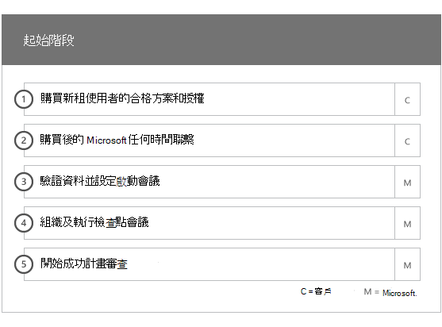
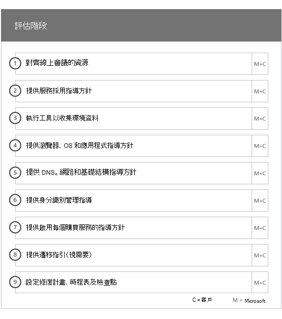
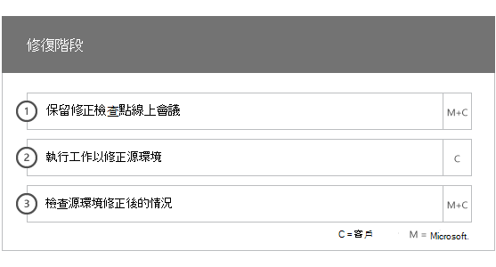
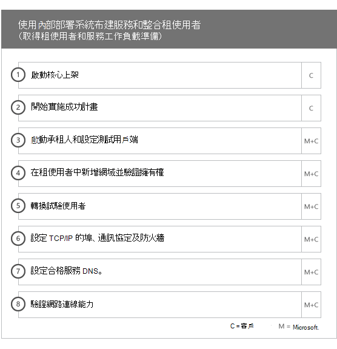
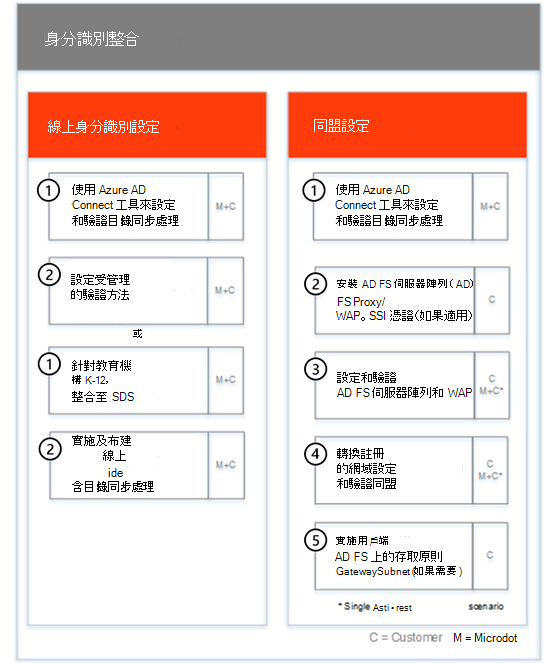
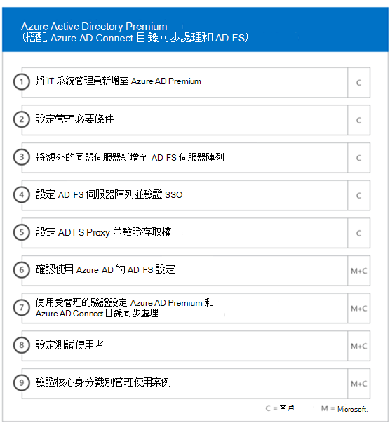
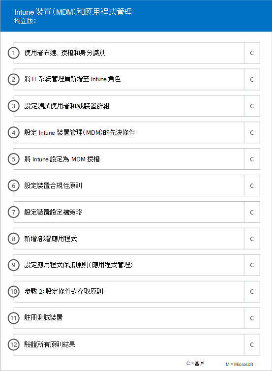

# 上線階段Onboarding Phases

使用 [合格服務與計劃](M365-eligible-services-and-plans.md) 使 Microsoft Azure Active Directory Premium、Microsoft Intune 和 Azure 資訊保護就緒時，程序中包含數個階段。When you use the [Eligible Services and Plans](M365-eligible-services-and-plans.md) to get Microsoft Azure Active Directory Premium, Microsoft Intune, and Azure Information Protection ready for use, there are several phases involved in the process. 以下幾節說明上線程序的每個階段。The following sections describe each phase of the onboarding process.

上線有四個主要階段：Onboarding has four primary phases:

## 起始階段Initiate phase

購買適當數量的授權之後，請遵循購買確認電子郵件中的指示，將授權與您現有或新租用戶產生關聯。After you purchase the appropriate number and types of licenses, follow the guidance from the purchase confirmation email to associate the licenses to your existing or new tenant. Microsoft 便會驗證您的 FastTrack 中心權益資格，並嘗試與您連絡以提供上線協助。Microsoft then verifies your eligibility for the FastTrack Center Benefit and tries to contact you to offer onboarding assistance.

> [!NOTE]
> 如果您已準備好要將這些服務部署到組織中，也可以從 [FastTrack 中心](https://go.microsoft.com/fwlink/?linkid=780698) 要求協助。You can also request assistance from the [FastTrack Center](https://go.microsoft.com/fwlink/?linkid=780698) if you're ready to deploy these services for your organization.

### 若要要求協助To request assistance

1. 登入 [FastTrack 網站](https://go.microsoft.com/fwlink/?linkid=780698)。Sign in to the [FastTrack site](https://go.microsoft.com/fwlink/?linkid=780698).
2. 選取 [FastTrack]\*\*\*\*。Select **FastTrack**.
3. 選取 [服務]\*\*\*\*。Select **Services**.
4. 填妥**要求協助使用 Microsoft 365** 表單。Complete the **Request for Assistance with Microsoft 365** form.

一旦上線支援啟動，我們將設定線上會議的排程。Once onboarding assistance starts, we set up a schedule of online meetings.

Microsoft 合作夥伴也可以透過 [FastTrack 網站](https://go.microsoft.com/fwlink/?linkid=780698)代表客戶取得協助。Partners can also get help through the [FastTrack site](https://go.microsoft.com/fwlink/?linkid=780698) on behalf of a customer. 若要這麼做︰To do so:

1. 登入 [FastTrack 網站](https://go.microsoft.com/fwlink/?linkid=780698)。Sign in to the [FastTrack site](https://go.microsoft.com/fwlink/?linkid=780698).
2. 選取 [FastTrack]\*\*\*\*。Select **FastTrack**.
3. 選取 [我的客戶]\*\*\*\*。Select **My Customers**.
4. 搜尋您的客戶或從客戶清單中選取他們。Search for your customer or select them from your customer list.
5. 選取 [服務]\*\*\*\*。Select **Services**.
6. 填妥**要求協助使用 Microsoft 365** 表單。Complete the **Request for Assistance with Microsoft 365** form.

一旦上線支援啟動，FastTrack 將設定與您進行的線上會議排程，以討論上線程序、 驗證資料及設定專案啟動會議。Once the onboarding support starts, FastTrack sets up a schedule of online meetings with you to discuss the onboarding process, verify data, and set up a kick-off meeting.

## 評估階段Assess phase

一旦上線程序開始，FastTrack 中心將配合您評估您的來源環境和需求。Once the onboarding process begins, the FastTrack Center works with you to assess your source environment and the requirements. 我們會執行工具來評估您的環境，FastTrack 專家會引導您評估內部部署 Active Directory、網際網路瀏覽器、用戶端裝置作業系統、網域名稱系統 (DNS)、網路、基礎結構和身分識別系統，以判斷針對上線是否需要進行任何變更。Tools are run to assess your environment, and FastTrack Specialists guide you through assessing your on-premises Active Directory, Internet browsers, client devices' operating systems, Domain Name System (DNS), network, infrastructure, and identity system to determine if any changes are required for onboarding.

FastTrack 中心也會提供如何驅動成功採用合格服務的相關指引。The FastTrack Center also connects you with guidance about how to drive successful adoption of the eligible services.

根據您目前的設定，我們將提供修復方案，該方案最高可將您的來源環境帶至成功上線為 EMS 或其個別雲端服務的最低系統需求。Based on your current setup, we provide a remediation plan that brings your source environment up to the minimum requirements for successful onboarding to Office 365 and, if needed, for successful mailbox and/or data migration. 我們也會對修復階段設定適當的檢查點通話。We also set up appropriate checkpoint calls for the Remediate phase.

## 修復階段Remediate phase
請在來源環境中執行修復方案中的工作，使您能夠符合將每項服務上線和採用的需求 (視需要)。You perform the tasks in the remediation plan on your source environment so that you meet the requirements for onboarding and adopting each service (as needed).

開始「啟用」階段之前，我們會一起驗證修復活動的成果，以確定您已準備就緒可繼續進行。Before beginning the Enable phase, we jointly verify the outcomes of the remediation activities to make sure you're ready to proceed.

## 啟用階段Enable phase
當所有修復活動都完成時，專案會轉為設定服務取用的核心基礎結構，以及佈建每個合格 EMS 雲端服務。When all remediation activities are complete, the focus shifts to configuring the core infrastructure for service consumption, provisioning Office 365, and conducting the activities to drive service adoption.

**啟用階段 - 核心功能****Enable phase - Core capabilities**

核心上線包括服務佈建和租用戶與身分識別整合。Core onboarding involves service provisioning and tenant and identity integration. 其中也包括提供 Azure AD Premium、Intune 和 Azure 資訊保護等上線線上服務基礎的步驟。It also includes steps for providing a foundation for onboarding online services like Azure AD Premium, Intune, and Azure Information Protection.

> [!NOTE]
> WAP 代表 Web 應用程式 Proxy。SSL 代表安全通訊端層。SDS 代表學校資料同步處理。有關 SDS 的詳細資訊，請參閱[歡迎使用 Microsoft 學校資料同步處理](https://go.microsoft.com/fwlink/?linkid=871480)。WAP stands for Web Application Proxy. SSL stands for Secure Sockets Layer. SDS stands for School Data Sync. For more information on SDS, see [Welcome to Microsoft School Data Sync](https://go.microsoft.com/fwlink/?linkid=871480).

> [!NOTE]
> 受管理的驗證方法包括但不限於密碼雜湊同步處理。A managed authentication method includes, but is not limited to password hash synchronization. 身分識別整合為一次性活動，而且不包括移轉或解除委任現有的驗證方法，例如受管理的驗證或同盟驗證。Identity integration is a one time activity and does not include migrating or decommissioning of existing authentication methods, such as managed or federated.

### 啟用階段 - Azure AD PremiumEnable phase - Azure AD Premium

Azure AD Premium 環境可以使用 Azure Active Directory Connect 工具目錄同步處理與 Active Directory Federation Services (AD FS) 進行設定 (視需要)。The Azure AD Premium environment can be set up by using the Azure Active Directory Connect tool directory synchronization and Active Directory Federation Services (AD FS) (as needed).

針對包含同步處理內部部署雲端身分識別的 Azure AD Premium 案例，我們會協助將 IT 系統管理員和使用者新增至您的訂用帳戶、設定管理必要條件、設定 Azure AD Premium、使用受管理的驗證設定目錄同步處理、使用 Azure AD Connect 工具設定 AD FS、設定測試使用者，並針對服務驗證您的核心使用案例。For Azure AD Premium scenarios that include synchronizing on-premises identities to the cloud, we help you by adding IT admins and users to your subscription, configuring management prerequisites, setting up Azure AD Premium, setting up directory synchronization with managed authentication and AD FS using the Azure AD Connect tool, configuring test users, and validating your core use cases for the service.

Azure AD Premium 設定包括啟用下列功能：Azure AD Premium setup includes enabling the following features:

-   Azure Active Directory 自助式密碼重設 (SSPR)。Azure Active Directory Self-Service Password Reset (SSPR).

-   Azure Multi-Factor Authentication (Azure MFA)。Azure Multi-Factor Authentication (Azure MFA).

-   從 [Azure Active Directory Marketplace](https://azure.microsoft.com/marketplace/active-directory/)，最多三個 (3) 或多個軟體即服務 (SaaS) 應用程式與單一登入 (SSO) 整合。Up to three (3) or more Software as a Service (SaaS) application integrations with Single Sign-On (SSO) from the [Azure Active Directory Marketplace](https://azure.microsoft.com/marketplace/active-directory/).

-   使用者自動佈建預先整合的 SaaS 應用程式 (如[應用程式整合教學課程清單](https://docs.microsoft.com/zh-TW/azure/active-directory/saas-apps/tutorial-list)所列) 僅限於向外佈建。Automatic user provisioning for pre-integrated SaaS applications as listed in the [App integration tutorial list](https://docs.microsoft.com/en-us/azure/active-directory/saas-apps/tutorial-list), limited to outbound provisioning only.

-   自訂登入畫面，包括商標、文字和影像。Customized logon screen, including logo, text, and images.

-   自助式群組及動態群組 (群組)。Self-Service and Dynamic Groups (Groups).

-   Azure Active Directory 應用程式 Proxy。Azure Active Directory Application Proxy.

-   Azure Active Directory Connect Health。Azure Active Directory Connect

-   Azure Active Directory 條件式存取。Azure Active Directory Conditional Access

-   Azure Active Directory 使用規定。Azure Active Directory Terms of Use.

-   Azure Active Directory Identity Protection。Azure Active Directory Identity Protection.

-   Azure Active Directory Privileged Identity Management。Azure Active Directory Privileged Identity Management.

-   Azure Active Directory 存取權檢閱。Azure Active Directory Conditional Access

### 啟用階段 - IntuneEnable phase - Intune

針對 Intune，我們會逐步引導您將 Microsoft Intune 就緒以管理裝置。For Intune, we guide you through getting ready to use Microsoft Intune to manage devices. 確切的步驟取決於您的來源環境，而且是根據您的行動裝置和行動裝置應用程式管理需求。The exact steps depend on your source environment and are based on your mobile device and mobile app management needs. 步驟可能包括：The steps can include:

-   授權使用者。Licensing your end users. 我們也會提供有關如何為 Microsoft 雲端服務租用戶啟用大量授權的協助 (視需要)。We also provide assistance on how to activate volume licenses for your Microsoft cloud service tenant (as needed).

-   利用內部部署 Active Directory 或雲端身分識別設定 Intune 所使用的身分識別。Configuring identities to be used by Intune by leveraging either your on-premises Active Directory or cloud identities.

-   將使用者新增到您的 Intune 訂用帳戶、定義 IT 系統管理員角色，以及建立使用者和裝置群組。Adding users to your Intune subscription, defining IT admin roles, and creating user and device groups.

-   根據您的管理需求，設定行動裝置管理 (MDM) 授權，包括：Configuring your Mobile Device Management (MDM) authority, based on your management needs, including:

    -   如果 Intune 是唯一的 MDM 解決方案，或是搭配 Office 365 的行動裝置管理，請將 Intune 設定為您的 MDM 授權單位。Setting Intune as your MDM authority when Intune is your only MDM solution or is in conjunction with Mobile Device Management for Office 365.

-   為下列提供 MDM 指引：Providing MDM guidance for:

    -   設定用於驗證 MDM 管理原則的測試群組。Configuring tests groups to be used to validate MDM management policies.

    -   設定 MDM 管理原則和服務，例如：Configuring MDM management policies and services like:

        -   透過網頁連結或深層連結，針對每個支援的平台進行應用程式部署。Application deployment for each supported platform through web links or deep links.

        -   條件式存取原則。Conditional access policies for identity

        -   部署電子郵件、無線網路和虛擬私人網路 (VPN) 設定檔 (如果貴組織中有現有的憑證授權單位、Wi-Fi 或 VPN 基礎結構)。Deployment of email, wireless networks, and virtual private network (VPN) profiles if you have an existing  certificate authority, Wi-Fi or VPN infrastructure in your organization.

        -   設定 Microsoft Intune Exchange Connector (如果適用)。Setting up the Microsoft Intune Exchange Connector (when applicable).

        -   連線到 Intune 資料倉儲Connecting to Intune Data Warehouse

        -   整合 Intune 與：Integrating Intune with:
            -   用於遠端協助的 Team Viewer (需要有 Team Viewer 訂用帳戶)。Team Viewer for remote assistance (Team viewer subscription is required).

            -   Mobile Threat Defense (MTD) 合作夥伴解決方案 (需要有 Mobile Threat Defense 訂用帳戶)。Mobile Threat Defense (MTD) partner solutions (Mobile Threat Defense subcription is required).

            -   電信費用管理解決方案 (需要有電信費用管理解決方案訂用帳戶)。Telecom expense management solution (Telecom expense management solution subscription is required).

            -   Windows Defender 進階威脅防護 (需要有 Windows E5 或 Microsoft 365 E5 授權)。Windows Defender Advanced Threat Protection (Windows E5 or Microsoft 365 E5 licenses are required).

    -   將每個[支援的平台](https://technet.microsoft.com/library/dn600287.aspx)的裝置註冊到 Intune。Enrolling devices of each [supported platform](https://technet.microsoft.com/library/dn600287.aspx) to Intune.

-   為下列提供「應用程式保護」指引：Providing App Protection guidance on:

    -   針對每個支援的平台設定應用程式保護原則。Configuring app protection policies for each supported platform.

    -   為受管理的應用程式設定條件式存取原則。Configuring conditional access policies for managed apps.

    -   使用上述 MAM 原則鎖定適當的使用者群組。Targeting the appropriate user groups with the above MAM policies.

    -   使用受管理的應用程式使用報告。Using managed-applications usage reports.

-   為下列提供電腦管理指引：Providing PC management guidance on:

    -   安裝 Intune 用戶端軟體 (視需要)。Installing the Intune client software (when needed).

    -   使用 Intune 中可用的軟體和硬體報告。Using the software and hardware reports available in Intune.

    > [!IMPORTANT]
    > FastTrack 不支援 Windows 10 傳統電腦管理搭配 Intune。FastTrack does not support Windows 10 classic PC management with Intune. FastTrack 僅透過 Intune 行動裝置管理 (MDM) 支援 Windows 10 裝置管理。FastTrack only supports Windows 10 device management through Intune mobile device management (MDM).

#### Windows AutopilotWindows Autopilot

FastTrack 可協助您以 Windows Autopilot 和 Intune 簡化裝置佈建，透過提供新裝置給使用者，不需建置、維護及將自訂的作業系統映像套用到您的裝置。FastTrack can help you through simplifying your device provisioning with Windows Autopilot and Intune by giving new devices to your end users without the need to build, maintain and apply custom operating system images to your devices.

FastTrack 支援下列 Autopilot 案例：FastTrack supports the following Autopilot scenarios:

- **Azure AD 自助：** 裝置加入 Azure AD 並註冊到 Intune。**Azure AD self-service:** Devices join Azure AD and enroll into Intune. 使用 Windows 10 1703 和最新版本時，支援此案例。This scenario is supported when using Windows 10 1703 and latest versions.

- **混合式 AAD 自助：** 裝置加入內部部署 AD 和 Azure AD，並註冊到 Intune。**Hybrid AAD self-service:** Devices join both on-premises AD and Azure AD and enroll into Intune. 使用 Windows 10 1809 和最新版本時，支援此案例。This scenario is supported when using Windows 10 1809 and latest versions.

- **自行佈建：** 裝置自動加入 Azure AD。**Self-provisioning:** Devices automatically join Azure AD. 使用 Windows 1809 和最新版本時，支援此案例。This scenario is supported when using Windows 1809 and latest versions.

    > [!IMPORTANT]
    > FastTrack 不支援 Configuration Manager 起始的 Autopilot 案例。FastTrack does not support Autopilot scenarios initiated from Configuration Manager.

設定 Windows Autopilot 的步驟取決於您的來源環境，而且可能包括：The steps to setup Windows Autopilot depends on your source environment and it can include:

- 設定並安裝 Windows Autopilot 適用的 Microsoft Intune。Configure and setup Microsoft Intune for Windows Autopilot.

- 設定 Azure AD 動態群組Configure Azure AD dynamic groups

- 將公司商標新增至 Azure AD。Add your Company branding into Azure AD.

- 建立裝置並將其指派至 Windows Autopilot 設定檔 (例如，限制本機系統管理員帳戶建立的 Windows Autopilot 設定檔)。Create and assign devices to Windows Autopilot profiles (e.g a Windows Autopilot profile that restricts Local Administrator account creation).

- 自訂全新體驗 (OOBE)，以符合組織的需求。Customize the Out-of-box-experience (OOBE) to comply with organization's requirements.

- 在 Azure AD 和 Intune 中設定 MDM 自動註冊。Configuring MDM Auto-enrollment in Azure AD and Intune.

#### 安全地部署 iOS 版和 Android 版 OutlookOutlook for iOS and Android

FastTrack 可協助您在組織內安全地部署 iOS 版和 Android 版 Outlook，以確保您的使用者安裝所有必要應用程式。FastTrack can help you by deploying Outlook for iOS and Android securely in your organization to ensure your users have all the required apps installed.

使用 Intune 安全地部署 iOS 版和 Android 版 Outlook Mobile 的步驟取決於您的來源環境，而且可能包括：The steps to securely deploy Outlook Mobile for iOS and Android with Intune depends on your source environment and it can include:

- 經由 Apple App Store 或 Google Play 商店下載 iOS 版和 Android 版 Outlook、Microsoft Authenticator 和 Intune 公司入口網站應用程式。Download Outlook for iOS and Android, Microsoft Authenticator and the Intune Company portal app via the Apple App Store or Google Play Store.
- 並提供以下設定的相關指引：Also provide guidance on setting up:
    - iOS 版和 Android 版 Outlook、Microsoft Authenticator 和 Intune 的 Intune 公司入口網站應用程式部署。Outlook for iOS and Android, Microsoft Authenticator and the Intune Company portal app deployment with Intune.
    - 應用程式保護原則App protection policies
    - 條件式存取原則Conditional access policies for identity
    - 應用程式組態原則App configuration policies

    > [!IMPORTANT]
    > FastTrack 小組不支援使用 Exchange 行動裝置信箱原則保護 iOS 版和 Android 版 Outlook。FastTrack team does not support securing Outlook for iOS and Android with Exchange mobile device mailbox policies.

#### 共同管理Co-management

FastTrack 會逐步引導您準備好同時使用 Configuration Manager 和 Intune 管理 Windows 10 裝置。FastTrack guides you through getting ready to concurrently manage Windows 10 devices with both Configuration Manager and Intune. 確切的步驟取決於您的來源環境，而且可能包括：The exact steps, depending on your source environment and your email migration plans, can include providing guidance for:

- 說明共同管理的優點。Explain the benefits of Co-management.

- 授權您的使用者。License your end users. FastTrack 也會提供有關如何為 Microsoft 雲端服務租用戶啟用大量授權的協助 (視需要)。FastTrack also provides assistance on how to activate volume licenses for your Microsoft cloud service tenant (as needed).

- 利用內部部署 Active Directory 和/或雲端身分識別設定 Intune 所使用的身分識別。Configure identities to be used by Intune by leveraging either your on-premises Active Directory and/or cloud identities.

- 將使用者新增到您的 Intune 訂用帳戶、定義 IT 系統管理員角色，以及建立使用者和裝置群組。Adding users to your Intune subscription, defining IT admin roles, and creating user and device groups.

- 提供如何將整合 System Center Configuration Manager (混合式) 的 Intune 移至獨立版 Intune 的相關指引。Provide guidance on how to move from Intune integrated with System Center Configuration Manager (Hybrid) to Intune Standalone.

- 提供針對 MDM 自動註冊設定 Azure Active Directory 的相關指引。Provide guidance on setting up Azure Active Directory for MDM auto-enrollment.

- 提供設定混合式 Azure Active Directory Join 的相關指引。Provide guidance setting up hybrid Azure Active Directory Join.

- 提供如何設定雲端管理閘道的相關指引。Provide guidance on how to set up Cloud Management Gateway

- 在 Configuration Manager 主控台中，啟用 [共同管理]。Enable Co-management in Configuration Manager console.

- 設定要切換到 Intune 的支援的工作負載。Configure supported workloads that you want to switch to Intune.

- 將 Configuration Manager 用戶端安裝在 Intune 中註冊的裝置。Install Configuration Manager client in Intune enrolled devices.

- 提供如何監控您環境中的共同管理活動的相關指引。Provide guidance on how to monitor the Co-management activity in your environment.

FastTrack 也會提供如何驅動成功採用合格服務的相關指引。FastTrack also provides you guidance on how to drive successful adoption of the eligible services.

#### 啟用階段 – Azure 資訊保護Enable phase – Azure Information Protection

提供客戶以下的相關指引：Customers are provided guidance on how to: 

- 啟用並設定其租用戶。Activate and configure their tenant.
- 建立及設定標籤和原則。Create and set up labels and policies.
- 將資訊保護套用至文件。Apply information protection to documents. 
- 在 Windows 上執行的 Office 應用程式中，使用 Azure 資訊保護用戶端自動分類資訊並加上標籤 (例如 Word、PowerPoint、Excel 和 Outlook)。Automatically classify and label information in Office apps (like Word, PowerPoint, Excel, and Outlook) running on Windows and using the Azure Information Protection client.
- 透過 Azure 資訊保護掃描器使用待用檔案。Use files at rest using the Azure Information Protection scanner.
- 使用 Exchange Online 郵件流程規則監視傳輸中的電子郵件。Monitor emails in transit using Exchange Online mail flow rules.

系統也會將指引提供給想要使用 Microsoft Azure Rights Management Services (Azure RMS)、Office 365 郵件加密 (OME)，以及資料外洩防護 (DLP) 套用保護的客戶。Guidance is also provided to customers who want to apply protection using Microsoft Azure Rights Management Services (Azure RMS), Office 365 Message Encryption (OME), and data loss prevention (DLP).

> [!NOTE]
> **想要深入了解？** 請參閱 [Enterprise Mobility + Security](https://www.microsoft.com/en-us/cloud-platform/enterprise-mobility)。**Want to learn more?** see [Enterprise Mobility + Security](https://www.microsoft.com/en-us/cloud-platform/enterprise-mobility).

## 後續步驟Next steps

[EMS 適用的 FastTrack 權益 - Microsoft 的責任FastTrack benefit for EMS - Microsoft responsibilities](EMS-fasttrack-responsibilities.md)
