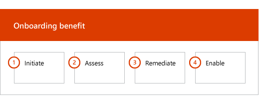

# 上架階段Onboarding Phases

當您使用的[合格服務與計劃](M365-eligible-services-and-plans.md)來取得 Microsoft Azure Active Directory Premium 和 Microsoft Intune 供使用，有數個階段程序中。When you use the [Eligible Services and Plans](M365-eligible-services-and-plans.md) to get Microsoft Azure Active Directory Premium and Microsoft Intune ready for use, there are several phases involved in the process. 下列各節說明每個階段的上架程序。The following sections describe each phase of the onboarding process.

上架有四個主要階段：Onboarding has four primary phases:

## 起始階段Initiate phase

購買適當數目的授權之後，請遵循指引来關聯至現有的租用戶或新租用戶的授權的購買確認電子郵件。After you purchase the appropriate number of licenses, follow the guidance from the purchase confirmation email to associate the licenses to your existing tenant or new tenant. Microsoft 然後驗證您的資格的 FastTrack Center 權益，並嘗試連絡您提供上架協助。Microsoft then verifies your eligibility for the FastTrack Center Benefit and tries to contact you to offer onboarding assistance.

> [!NOTE]
> 您也可以要求[FastTrack Center](https://go.microsoft.com/fwlink/?linkid=780698)協助，如果您已準備好部署這些服務的組織。You can also request assistance from the [FastTrack Center](https://go.microsoft.com/fwlink/?linkid=780698) if you're ready to deploy these services for your organization.

### 若要要求協助To request assistance

1. 登入 [FastTrack 網站](https://go.microsoft.com/fwlink/?linkid=780698)。Sign in to the [FastTrack site](https://go.microsoft.com/fwlink/?linkid=780698).
2. 選取 [FastTrack]\*\*\*\*。Select **FastTrack**.
3. 選取 [服務]\*\*\*\*。Select **Services**.
4. 完成的**要求協助使用 Microsoft 365 表單**。Complete the **Request for Assistance with Microsoft 365 form**.

一旦上架權益啟動，我們會將設定線上會議的排程。Once onboarding support starts, we’ll set up a schedule of online meetings.

> [!NOTE]
> 如果您有 Microsoft 合作夥伴列在您的 Office 365 租用戶，您無法看到此選項。If you have a Microsoft partner listed in your Office 365 tenant, you won't see this option. 請洽詢您的 Microsoft 合作夥伴的協助。Please consult your Microsoft partner for assistance.

Microsoft 合作夥伴也可以取得說明透過[FastTrack 網站](https://go.microsoft.com/fwlink/?linkid=780698)代表客戶。Microsoft partners can also get help through the [FastTrack site](https://go.microsoft.com/fwlink/?linkid=780698) on behalf of a customer. To do so:To do so:

1. 登入 [FastTrack 網站](https://go.microsoft.com/fwlink/?linkid=780698)。Sign in to the [FastTrack site](https://go.microsoft.com/fwlink/?linkid=780698).
2. 選取 [FastTrack]\*\*\*\*。Select **FastTrack**.
3. 選取 [我的客戶]\*\*\*\*。Select **My Customers**.
4. 搜尋您的客戶或從客戶清單中選取他們。Search for your customer or select them from your customer list.
5. 選取 [服務]\*\*\*\*。Select **Services**.
6. 完成的**要求協助使用 Microsoft 365 表單**。Complete the **Request for Assistance with Microsoft 365 form**.

一旦上架支援啟動時，FastTrack 會設定與您討論上架程序、 驗證資料，並設定開始會議的線上會議的排程。Once the onboarding support starts, FastTrack sets up a schedule of online meetings with you to discuss the onboarding process, verify data, and set up a kick-off meeting.

## 評估階段Assess phase

一旦上架程序開始時，FastTrack Center 適用於您評估您的來源環境和需求。Once the onboarding process begins, the FastTrack Center works with you to assess your source environment and the requirements. 若要評估您的環境，位於執行工具與 FastTrack 專家將引導您完成評估您的內部部署 Active Directory、 網際網路瀏覽器、 用戶端裝置的作業系統、 網域名稱系統 (DNS)、 網路、 基礎結構及身分識別系統決定是否需要上架的任何變更。Tools are run to assess your environment, and FastTrack Specialists guide you through assessing your on-premises Active Directory, Internet browsers, client devices' operating systems, Domain Name System (DNS), network, infrastructure, and identity system to determine if any changes are required for onboarding.

FastTrack Center 也讓您連線如何驅動成功採用合格服務的相關指引。The FastTrack Center also connects you with guidance about how to drive successful adoption of the eligible services.

根據您目前的設定，我們提供 EMS 或其個別雲端服務會帶您最多成功登入的最小需求的來源環境的修復計劃。Based on your current setup, we provide a remediation plan that brings your source environment up to the minimum requirements for successful onboarding to EMS or its individual cloud services. 我們也設定適當的檢查點通話修復階段。We also set up appropriate checkpoint calls for the remediation phase.

## 修復階段Remediate phase
您執行的工作的修復計劃在來源環境，使得您能夠符合上架和採用 （視需要） 的每個服務的需求。You perform the tasks in the remediation plan on your source environment so that you meet the requirements for onboarding and adopting each service (as needed).

開始 「 啟用 」 階段之前，我們會一起驗證來確定您已準備就緒可繼續進行修復活動的成果。Before you begin the Enable phase, we jointly verify the outcomes of the remediation activities to make sure you’re ready to proceed.

## 啟用階段Enable phase
當所有修復活動都都完成時，專案會進入設定服務取用的核心基礎結構，以及佈建每個合格的 EMS 雲端服務。When all remediation activities are complete, the project shifts to configuring the core infrastructure for service consumption and to provisioning each eligible EMS cloud service.

**啟用階段-核心功能****Enable phase - Core capabilities**

核心上架包括服務佈建和租用戶與身分識別整合。Core onboarding involves service provisioning and tenant and identity integration. 它還包括提供基礎以讓上架的線上服務，例如 Azure AD Premium 和 Intune 的步驟。It also includes steps for providing a foundation for onboarding online services such as Azure AD Premium and Intune.

> [!NOTE]
> WAP 代表 Web 應用程式 Proxy。SSL 代表安全通訊端層。SDS 代表學校資料同步處理。有關 SDS 的詳細資訊，請參閱[歡迎使用 Microsoft 學校資料同步處理](https://go.microsoft.com/fwlink/?linkid=871480)。WAP stands for Web Application Proxy. SSL stands for Secure Sockets Layer. SDS stands for School Data Sync. For more information on SDS, see [Welcome to Microsoft School Data Sync](https://go.microsoft.com/fwlink/?linkid=871480).

> [!NOTE]
> 受管理的驗證方法包括，但不限於密碼雜湊同步處理。A managed authentication method includes, but is not limited to password hash synchronization. 身分識別整合是一份計時活動，並不包含移轉或停用現有的驗證方法，例如受管理或同盟。Identity integration is a one time activity and does not include migrating or decommissioning of existing authentication methods, such as managed or federated.

### 啟用階段-Azure AD PremiumEnable phase - Azure AD Premium

Azure AD Premium 環境可以設定使用 Active Directory Federation Services (AD FS) 與 Azure Active Directory Connect 工具的目錄同步處理 （視需要）。The Azure AD Premium environment can be set up by using the Azure Active Directory Connect tool directory synchronization and Active Directory Federation Services (AD FS) (as needed).

對於包含同步處理至雲端的內部部署身分識別的 Azure AD Premium 案例，我們幫助您藉由將 IT 系統管理員和使用者新增至您的訂閱，設定管理先決條件，設定 Azure AD Premium，設定目錄同步處理與受管理的驗證與 AD FS 使用 Azure AD Connect 工具，設定測試使用者，驗證您的核心服務使用情況。For Azure AD Premium scenarios that include synchronizing on-premises identities to the cloud, we help you by adding IT admins and users to your subscription, configuring management prerequisites, setting up Azure AD Premium, setting up directory synchronization with managed authentication and AD FS using the Azure AD Connect tool, configuring test users, and validating your core use cases for the service.

Azure AD Premium 安裝程式包括啟用下列功能：Azure AD Premium setup includes enabling the following features:

-   Azure Active Directory 自助密碼重設 (SSPR)。Azure Active Directory Self-Service Password Reset (SSPR).

-   Azure 多重要素驗證 (Azure MFA)。Azure Multi-Factor Authentication (Azure MFA).

-   最多三個 (3) 或多個軟體即服務 (SaaS) 應用程式整合搭配單一登入 (SSO) 從[Azure Active Directory 服務商場](https://azure.microsoft.com/marketplace/active-directory/)。Up to three (3) or more Software as a Service (SaaS) application integrations with Single Sign-On (SSO) from the [Azure Active Directory Marketplace](https://azure.microsoft.com/marketplace/active-directory/).

-   自動使用者佈建預先整合的 SaaS 應用程式所列在[應用程式整合教學課程清單](https://docs.microsoft.com/en-us/azure/active-directory/saas-apps/tutorial-list)，限制為僅限輸出的佈建。Automatic user provisioning for pre-integrated SaaS applications as listed in the [App integration tutorial list](https://docs.microsoft.com/en-us/azure/active-directory/saas-apps/tutorial-list), limited to outbound provisioning only.

-   自訂登入畫面，其中包括標誌、 文字和影像。Customized logon screen, including logo, text, and images.

-   自助服務和動態群組 （群組）。Self-Service and Dynamic Groups (Groups).

-   Azure Active Directory 應用程式 Proxy。Azure Active Directory Application Proxy.

-   Azure Active Directory Connect Health。Azure Active Directory Connect Health.

-   Azure Active Directory 條件式存取。Azure Active Directory Conditional Access.

-   使用 azure Active Directory 規定。Azure Active Directory Terms of Use.

-   Azure Active Directory Identity Protection。Azure Active Directory Identity Protection.

-   Azure Active Directory 特殊權限的身分識別管理。Azure Active Directory Privileged Identity Management.

-   Azure Active Directory 存取評論。Azure Active Directory Access Reviews.

### 啟用階段-IntuneEnable phase - Intune

針對 Intune，我們引導您進行準備好要使用 Microsoft Intune 管理裝置。For Intune, we guide you through getting ready to use Microsoft Intune to manage devices. 確切的步驟取決於您的來源環境取決於您的行動裝置和行動應用程式管理需要。The exact steps depend on your source environment and are based on your mobile device and mobile app management needs. 步驟可以包括：The steps can include:

-   授權您的使用者。Licensing your end users. 我們也提供協助如何大量授權啟動您 Microsoft 雲端服務租用戶 （視需要）。We also provide assistance on how to activate volume licenses for your Microsoft cloud service tenant (as needed).

-   設定是由 Intune 使用運用您的內部部署 Active Directory 或雲端身分識別的身分識別。Configuring identities to be used by Intune by leveraging either your on-premises Active Directory or cloud identities.

-   將使用者新增至您 Intune 訂用帳戶、 定義 IT 系統管理員角色，並建立使用者和裝置群組。Adding users to your Intune subscription, defining IT admin roles, and creating user and device groups.

-   設定您的行動裝置管理 (MDM) 授權單位，請根據您管理的需求，包括：Configuring your Mobile Device Management (MDM) authority, based on your management needs, including:

    -   當 Intune 是唯一的 MDM 解決方案，或為搭配 Office 365 的行動裝置管理，請將 Intune 設定為 MDM 授權單位。Setting Intune as your MDM authority when Intune is your only MDM solution or is in conjunction with Mobile Device Management for Office 365.

-   提供 MDM 指導：Providing MDM guidance for:

    -   設定要用來驗證 MDM 管理原則的測試群組。Configuring tests groups to be used to validate MDM management policies.

    -   設定 MDM 管理原則和等服務：Configuring MDM management policies and services like:

        -   每個應用程式部署支援的平台透過 web 連結或深層連結。Application deployment for each supported platform through web links or deep links.

        -   條件式存取原則。Conditional access policies.

        -   部署的電子郵件、 無線網路和虛擬私人網路 (VPN) 設定檔如果貴組織中有現有的憑證授權單位、 Wi-fi 或 VPN 基礎結構。Deployment of email, wireless networks, and virtual private network (VPN) profiles if you have an existing  certificate authority, Wi-Fi or VPN infrastructure in your organization.

        -   設定 Microsoft Intune Exchange 連接器 （於適用時）。Setting up the Microsoft Intune Exchange Connector (when applicable).

        -   連線到 Intune 資料倉儲Connecting to Intune Data Warehouse

        -   整合與 Intune:Integrating Intune with:
            -   遠端協助 」 的小組檢視器 （小組檢視器訂閱是必要的）。Team Viewer for remote assistance (Team viewer subscription is required).

            -   行動裝置威脅防護 （銷售額） 協力廠商解決方案 （行動威脅國防版訂閱是必要的）。Mobile Threat Defense (MTD) partner solutions (Mobile Threat Defense subcription is required).

            -   電信費用管理解決方案 （電信費用管理方案訂閱是必要的）。Telecom expense management solution (Telecom expense management solution subscription is required).

            -   Windows Defender 進階威脅防護 （Windows 版 E5 或 Microsoft 365 E5 授權所需）。Windows Defender Advanced Threat Protection (Windows E5 or Microsoft 365 E5 licenses are required).

    -   註冊每個[支援的平台](https://technet.microsoft.com/library/dn600287.aspx)Intune 的裝置。Enrolling devices of each [supported platform](https://technet.microsoft.com/library/dn600287.aspx) to Intune.

-   提供應用程式防護指導方針：Providing App Protection guidance on:

    -   設定每個支援的平台的應用程式保護原則。Configuring app protection policies for each supported platform.

    -   設定受管理的應用程式的條件式存取原則。Configuring conditional access policies for managed apps.

    -   選取目標與上述的 MAM 原則的適當的使用者群組。Targeting the appropriate user groups with the above MAM policies.

    -   使用受管理的應用程式使用狀況報告。Using managed-applications usage reports.

-   上提供的電腦管理下列項目的指引：Providing PC management guidance on:

    -   安裝 Intune 用戶端軟體 （如果需要）。Installing the Intune client software (when needed).

    -   使用軟體和硬體 Intune 中可用的報告。Using the software and hardware reports available in Intune.

    > [!IMPORTANT]
    > FastTrack 不支援使用 Intune Windows 10 傳統電腦管理。FastTrack does not support Windows 10 classic PC management with Intune. FastTrack 只支援透過 Intune 行動裝置管理 (MDM) 的 Windows 10 裝置管理。FastTrack only supports Windows 10 device management through Intune mobile device management (MDM).

#### Windows AutopilotWindows Autopilot

FastTrack 可協助您簡化您的裝置佈建與 Windows Autopilot 和 Intune，讓新的裝置至您的使用者不需要來建立、 維護和自訂作業系統映像套用到您的裝置。FastTrack can help you through simplifying your device provisioning with Windows Autopilot and Intune by giving new devices to your end users without the need to build, maintain and apply custom operating system images to your devices.

FastTrack 支援下列 Autopilot 案例：FastTrack supports the following Autopilot scenarios:

- **Azure AD 自助：** 裝置加入 Azure AD 和到 Intune 註冊。**Azure AD self-service:** Devices join Azure AD and enroll into Intune. 使用 Windows 10 1703年和最新版本時，被支援此案例。This scenario is supported when using Windows 10 1703 and latest versions.

- **混合 AAD 自助：** 裝置加入同時在內部部署 AD 和 Azure AD 和到 Intune 註冊。**Hybrid AAD self-service:** Devices join both on-premises AD and Azure AD and enroll into Intune. 使用 Windows 10 1809年和最新版本時，被支援此案例。This scenario is supported when using Windows 10 1809 and latest versions.

- **自我佈建：** 裝置會自動加入 Azure AD。**Self-provisioning:** Devices automatically join Azure AD. 使用 Windows 1809 和最新版本時，被支援此案例。This scenario is supported when using Windows 1809 and latest versions.

    > [!IMPORTANT]
    > FastTrack 不支援自動駕駛案例起始從 Configuration Manager。FastTrack does not support Autopilot scenarios initiated from Configuration Manager.

若要安裝 Windows Autopilot 步驟取決於您的來源環境，且可以包含：The steps to setup Windows Autopilot depends on your source environment and it can include:

- 設定並針對 Windows Autopilot 安裝 Microsoft Intune。Configure and setup Microsoft Intune for Windows Autopilot.

- 設定 Azure AD 動態群組Configure Azure AD dynamic groups

- 新增公司商標至 Azure AD。Add your Company branding into Azure AD.

- 建立和指派給 Windows Autopilot 設定檔 （例限制本機系統管理員帳戶建立 Windows Autopilot 設定檔） 的裝置。Create and assign devices to Windows Autopilot profiles (e.g a Windows Autopilot profile that restricts Local Administrator account creation).

- 自訂擴充的-全新體驗 (OOBE)，以符合組織的需求。Customize the Out-of-box-experience (OOBE) to comply with organization's requirements.

- 在 Azure AD 中設定的 MDM 自動註冊和 Intune。Configuring MDM Auto-enrollment in Azure AD and Intune.

#### 安全地部署 Outlook for iOS 和 AndroidDeploy Outlook for iOS and Android securely

FastTrack 可協助您藉由貴組織，以確保您的使用者必須安裝的所有必要應用程式中安全地部署 Outlook for iOS 和 Android。FastTrack can help you by deploying Outlook for iOS and Android securely in your organization to ensure your users have all the required apps installed.

安全地 for iOS 和 Android 使用 Intune 部署 Outlook Mobile 步驟取決於您的來源環境，且可以包含：The steps to securely deploy Outlook Mobile for iOS and Android with Intune depends on your source environment and it can include:

- 下載 Outlook for iOS 和 Android、 Microsoft Authenticator 和 Intune 公司入口網站應用程式透過 Apple App Store 或 Google Play 商店。Download Outlook for iOS and Android, Microsoft Authenticator and the Intune Company portal app via the Apple App Store or Google Play Store.
- 上設定，也提供下列項目的指引：Also provide guidance on setting up:
    - Outlook for iOS 和 Android、 Microsoft Authenticator 和使用 Intune Intune 公司入口網站應用程式部署。Outlook for iOS and Android, Microsoft Authenticator and the Intune Company portal app deployment with Intune.
    - 應用程式保護原則App protection policies
    - 條件式存取原則Conditional access policies
    - 應用程式設定原則App configuration policies

    > [!IMPORTANT]
    > FastTrack 團隊不支援使用 Exchange 的行動裝置信箱原則保護 Outlook for iOS 和 Android。FastTrack team does not support securing Outlook for iOS and Android with Exchange mobile device mailbox policies.

#### 共同撰寫管理Co-management

FastTrack 會引導您準備好要同時管理 Configuration Manager 和 Intune 的 Windows 10 裝置。FastTrack guides you through getting ready to concurrently manage Windows 10 devices with both Configuration Manager and Intune. 確切的步驟，取決於您的來源環境，且可以包含：The exact steps depend on your source environment, and it can include:

- 說明共同管理的優點。Explain the benefits of Co-management.

- 授權您的使用者。License your end users. FastTrack 也提供如何大量授權啟動您 Microsoft 雲端服務租用戶 （視需要） 的協助。FastTrack also provides assistance on how to activate volume licenses for your Microsoft cloud service tenant (as needed).

- 設定可用於由 Intune 利用下列一項來識別您的內部部署 Active Directory 及/或雲端身分識別。Configure identities to be used by Intune by leveraging either your on-premises Active Directory and/or cloud identities.

- 將使用者新增至您 Intune 訂用帳戶、 定義 IT 系統管理員角色，並建立使用者和裝置群組。Adding users to your Intune subscription, defining IT admin roles, and creating user and device groups.

- 提供如何從 Intune 整合與 System Center Configuration Manager （混合），以 Intune 獨立移動指引。Provide guidance on how to move from Intune integrated with System Center Configuration Manager (Hybrid) to Intune Standalone.

- 指導您設定的 MDM 自動註冊 microsoft Azure Active Directory。Provide guidance on setting up Azure Active Directory for MDM auto-enrollment.

- 提供指導方針設定混合式 Azure [Active Directory 加入。Provide guidance setting up hybrid Azure Active Directory Join.

- 指導您如何設定雲端管理閘道Provide guidance on how to set up Cloud Management Gateway

- 啟用 Configuration Manager 主控台中的共同管理。Enable Co-management in Configuration Manager console.

- 設定您想要切換到 Intune 的支援工作負載。Configure supported workloads that you want to switch to Intune.

- 安裝 Configuration Manager 用戶端在 Intune 中的註冊裝置。Install Configuration Manager client in Intune enrolled devices.

- 提供如何監視環境中的共同管理活動的指引。Provide guidance on how to monitor the Co-management activity in your environment.

FastTrack 也提供您指引如何驅動成功採用合格服務。FastTrack also provides you guidance on how to drive successful adoption of the eligible services.

> [!NOTE]
> **想要了解更多？** 請參閱[Enterprise Mobility + Security](https://www.microsoft.com/en-us/cloud-platform/enterprise-mobility)。**Want to learn more?** see [Enterprise Mobility + Security](https://www.microsoft.com/en-us/cloud-platform/enterprise-mobility).

## 後續步驟Next steps

[適用於 EMS-Microsoft 責任的 FastTrack 權益FastTrack benefit for EMS - Microsoft responsibilities](EMS-fasttrack-responsibilities.md)
