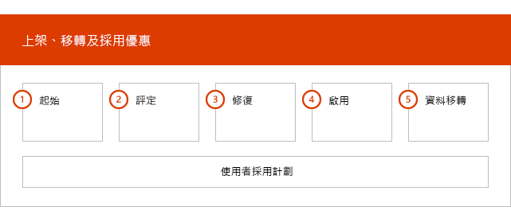
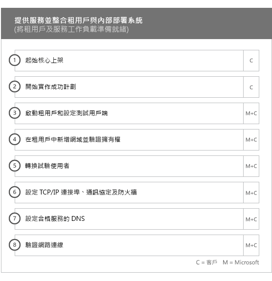
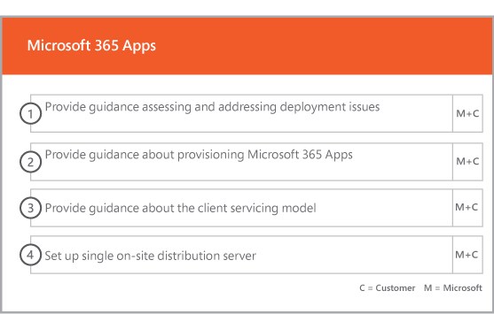

# 上架及移轉階段Onboarding and Migration Phases

> [!CAUTION]
> 此內容已不再是最新的，且已排程為待移除。This content is no longer current and is scheduled for removal. 使用目前內容左側導覽中的目錄。Use the table of contents in the left-hand navigation for current content.

Office 365 上架有四個主要階段 - 起始、評估、修復與啟用。您可以在這些階段後面選擇接著資料移轉階段，如下圖所示。Office 365 onboarding has four primary phases—Initiate, Assess, Remediate, and Enable. You can follow these phases with an optional data migration phase as shown in the following figure.
  

  
> [!NOTE]
>如需 Office 365 US Government 的上架和移轉詳細資訊，請參閱 [Office 365 US Government 的上架和移轉](US-Gov-appendix-onboarding-and-migration.md)。For information on onboarding and migration for Office 365 US Government, see [Onboarding and Migration for Office 365 US Government](US-Gov-appendix-onboarding-and-migration.md). 

如需了解每個階段的詳細工作，請參閱 [FastTrack 責任](O365-fasttrack-responsibilities.md)和[您的責任](O365-your-responsibilities.md)。For detailed tasks for each phase, see [FastTrack Responsibilities](O365-fasttrack-responsibilities.md) and [Your Responsibilities](O365-your-responsibilities.md).
  
## 起始階段Initiate phase

購買適當數量和類型的授權之後，請遵循購買確認電子郵件中的指示，將授權與您現有或新租用戶產生關聯。After you purchase the appropriate number and types of licenses, follow the guidance from the purchase confirmation email to associate the licenses to your existing or new tenant. 
  
您可以透過 [Microsoft 365 系統管理中心](https://go.microsoft.com/fwlink/?linkid=2032704)或 [FastTrack 網站](https://go.microsoft.com/fwlink/?linkid=780698)取得協助。You can get help through the [Microsoft 365 admin center](https://go.microsoft.com/fwlink/?linkid=2032704) or the [FastTrack site](https://go.microsoft.com/fwlink/?linkid=780698). 

若要透過 [Microsoft 365 系統管理員中心](https://go.microsoft.com/fwlink/?linkid=2032704)取得協助，您的系統管理員需要登入至系統管理員中心，然後按一下 **[需要協助？]** Widget。To get help through the [Microsoft 365 admin center](https://go.microsoft.com/fwlink/?linkid=2032704), your admin signs into the admin center and then clicks the **Need help?** widget. 

若要透過 [FastTrack 網站](https://go.microsoft.com/fwlink/?linkid=780698)取得協助：To get help through the [FastTrack site](https://go.microsoft.com/fwlink/?linkid=780698): 
1.    登入 [FastTrack 網站](https://go.microsoft.com/fwlink/?linkid=780698)。Sign in to the [FastTrack site](https://go.microsoft.com/fwlink/?linkid=780698). 
2.    從登陸頁面上方的 **快速動作** 選取 **使用 Microsoft 365 要求協助**。Select **Request assistance with Microsoft 365** from the **quick actions** on the top of your landing page.
3.    填妥**使用 Microsoft 365 要求協助** 表單。Complete the **Request Assistance with Microsoft 365** form.
  
合作夥伴也可以透過 [FastTrack 網站](https://go.microsoft.com/fwlink/?linkid=780698)代表客戶取得協助。作法如下：Partners can also get help through the [FastTrack site](https://go.microsoft.com/fwlink/?linkid=780698) on behalf of a customer. To do so:
1.    登入 [FastTrack 網站](https://go.microsoft.com/fwlink/?linkid=780698)。Sign in to the [FastTrack site](https://go.microsoft.com/fwlink/?linkid=780698). 
2.    從登陸頁面上方的 **快速動作** 選取 **使用 Microsoft 365 要求協助**。Select **Request assistance with Microsoft 365** from the **quick actions** on the top of your landing page.
3.    輸入客戶名稱、網域或 TPID 來搜尋您的客戶。Search for your customer by entering the customer name, domain, or TPID.
4.    從搜尋結果中選取客戶。Select customer from the search results.
5.    填妥**使用 Microsoft 365 要求協助** 表單。Complete the **Request Assistance with Microsoft 365** form.

您也可以從租用戶的可用服務清單中的 FastTrack Center[FastTrack 網站](https://go.microsoft.com/fwlink/?linkid=780698)要求協助。You can also ask for FastTrack Center help from the [FastTrack site](https://go.microsoft.com/fwlink/?linkid=780698) in the list of available services for your tenant. 
    
在此階段，我們討論了上架程序、驗證您的資料、並設定開始會議。這包括與您合作以了解您要如何使用該服務及貴組織的目標，並推動服務使用的計劃。During this phase, we discuss the onboarding process, verify your data, and set up a kickoff meeting. This includes working with you to understand how you intend to use the service and your organization's goals and plans to drive service usage.
  

  
## 評估階段Assess phase

您的 FastTrack 專案經理會透過電話與您和您的採用小組針對如何做出成功的規劃進行互動討論。在討論過程中，他會為您介紹您購買的合格服務的功能、讓計劃成功所需的關鍵基礎、促進服務使用量的方法，以及您可以用來獲取服務價值的案例。我們會協助您做出成功的規劃，並 (視需要) 就關鍵領域提供意見。Your FastTrack Manager conducts an interactive success planning call with you and your adoption team. This introduces you to the capabilities of the eligible services you purchased, the key foundations you need for success, the methodology for driving usage of the service, and scenarios you can use to get value from the services. We assist you in success planning and provide feedback on key areas (as needed).
  
FastTrack 專家將配合您評估您的來源環境和需求。我們為您提供工具來收集有關您環境的資料，並引導您估計頻寬需求以及進行網際網路瀏覽器、用戶端作業系統、網域名稱系統 (DNS)、網路、基礎結構和身分識別系統的評估，以判斷針對上架是否需要進行任何變更。FastTrack Specialists work with you to assess your source environment and the requirements. We provide tools for you to gather data about your environment and  guide you through estimating bandwidth requirements and assessing your internet browsers, client operating systems, Domain Name System (DNS), network, infrastructure, and identity system to determine if any changes are required for onboarding. 
  
根據您目前的設定，我們將提供修復方案，該方案最高可將您的來源環境帶至成功上架為 Office 365 的最低系統需求，以及成功進行信箱和/或資料移轉 (如果需要)。我們會提供一組建議活動來增加使用者價值和採用率。我們也將對修復階段設定適當的檢查點通話。Based on your current setup, we provide a remediation plan that brings your source environment up to the minimum requirements for successful onboarding to Office 365 and, if needed, for successful mailbox and/or data migration. We provide a set of suggested activities to increase end user value and adoption. We also set up appropriate checkpoint calls for the Remediate phase.
  

  
## 修復階段Remediate phase

您將在來源環境中執行修復工作，使得您能夠符合將每項服務上架、採用和移轉需求。You do the remediation tasks based on your source environment so that you meet the requirements for onboarding, adopting, and migrating each service as needed.
  

  
我們也會提供一組建議活動來增加使用者價值和採用率。開始「啟用」階段之前，我們會一起驗證修復活動的成果，以確定您已準備就緒可繼續進行。We also provide a set of suggested activities to increase end user value and adoption. Before beginning the Enable phase, we jointly verify the outcomes of the remediation activities to make sure you're ready to proceed. 
  
在此階段，您的 FastTrack 專案經理會與您合作以設計出成功的規劃，引導您找到合適的資源與最佳作法，提供指引以利您提供服務給您的組織並促進服務之間的使用量。During this phase, your FastTrack Manager works with you on success planning, guiding you to the right resources and best practices to provide guidance for you to make the service available to your organization and drive usage across the services.
  
## 啟用階段Enable phase

當所有修復活動都完成時，焦點會進入設定服務取用的核心基礎結構、佈建 Office 365，以及處理活動來進行脲服務採用。When all remediation activities are complete, the focus shifts to configuring the core infrastructure for service consumption, provisioning Office 365, and conducting the activities to drive service adoption. 
  
## 核心Core

核心上架包括服務佈建和租用戶與身分識別整合。它還包括提供基礎以讓 Exchange Online、SharePoint Online 和 商務用 Skype Online 等服務上架的步驟。您和您的 FastTrack 專案經理仍會舉行成功規劃檢查點會議，以評估目標進度並判斷您需要哪些進一步的協助。Core onboarding involves service provisioning and tenant and identity integration. It also includes steps for providing a foundation for onboarding services like Exchange Online, SharePoint Online, and Skype for Business Online. You and your FastTrack Manager continue to have success planning checkpoint meetings to evaluate progress against your goals and determine what further assistance you need.
  

  

  
> [!NOTE]
> WAP 代表 Web 應用程式 Proxy。SSL 代表安全通訊端層。SDS 代表學校資料同步處理。有關 SDS 的詳細資訊，請參閱[歡迎使用 Microsoft 學校資料同步處理](https://go.microsoft.com/fwlink/?linkid=871480)。WAP stands for Web Application Proxy. SSL stands for Secure Sockets Layer. SDS stands for School Data Sync. For more information on SDS, see [Welcome to Microsoft School Data Sync](https://go.microsoft.com/fwlink/?linkid=871480). 
  
將一或多個合格服務上架的動作可以從核心上架完成時開始。Onboarding for one or more eligible services can begin once core onboarding is finished.
  
## Exchange OnlineExchange Online

對於 Exchange Online，我們將引導您讓組織準備好使用電子郵件的程序。確切步驟因您的來源環境和電子郵件移轉方案有所不同，可能包含提供下列項目的指引：For Exchange Online, we guide you through the process to get your organization ready to use email. The exact steps, depending on your source environment and your email migration plans, can include providing guidance for:
- 針對在 Office 365 中驗證的所有已啟用郵件的網域設定 Exchange Online Protection (EOP) 功能。Setting up Exchange Online Protection (EOP) features for all mail-enabled domains validated in Office 365.
    > [!NOTE]
    > 您的郵件交換 (MX) 記錄必須指向 Office 365。Your mail exchange (MX) records must point to Office 365. 
- 設定 Office 365 進階威脅防護 (ATP) 功能 (如果它是您訂閱服務的一部分)。Setting up the Office 365 Advanced Threat Protection (ATP) feature if it's part of your subscription service. 如需詳細資訊，請參閱 [Office 365 進階威脅防護](#office-365-advanced-threat-protection)。For more information, see [Office 365 Advanced Threat Protection](#office-365-advanced-threat-protection).
- 為 Office 365 中經驗證之所有已啟用郵件的網域設定資料遺失保護 (DLP) 功能，作為訂閱服務的一部分。將您的 MX 記錄指向 Office 365 之後即完成此項設定。Setting up the data loss prevention (DLP) feature for all mail-enabled domains validated in Office 365 as part of your subscription service. This is done once your MX records point to Office 365.
- 為 Office 365 中經驗證之所有已啟用郵件的網域設定 Office 365 訊息加密 (OME) 功能，作為訂閱服務的一部分。將您的 MX 記錄指向 Office 365 之後即完成此項設定。Setting up Office 365 Message Encryption (OME) for all mail-enabled domains validated in Office 365 as part of your subscription service. This is done once your MX records point to Office 365.

> [!NOTE]
> 信箱複寫服務 (MRS) 會嘗試將您內部部署信箱中受資訊版權管理 (IRM) 的電子郵件移轉至對應的 Exchange Online 信箱。The Mailbox Replication service (MRS) attempts to migrate Information Rights Managed (IRM) emails from your on-premises mailbox to the corresponding Exchange Online mailbox. 在移轉之後，客戶必須將 Active Directory Rights Management Services (AD RMS) 範本複製到 Azure 版權管理服務 (Azure RMS)，才能讀取受保護的內容。Ability to read the protected content post-migration depends on the customer mapping and copying Active Directory Rights Managed Services (AD RMS) templates to the Azure Rights Management Service (Azure RMS).

- 設定防火牆連接埠。Configuring firewall ports.
- 視需要設定 DNS、併入需要的自動探索、寄件者原則架構 (SPF) 和 MX 記錄。Setting up DNS, including the required Autodiscover, sender policy framework (SPF), and MX records (as needed). 
- 如果需要，則設定您的來源訊息環境與 Exchange Online 間的電子郵件流程。Setting up email flow between your source messaging environment and Exchange Online (as needed).
- 進行從來源郵件環境到 Office 365 的郵件移轉。Undertaking mail migration from your source messaging environment to Office 365.
- 設定信箱用戶端 (Outlook for Windows、Outlook 網頁版，以及 Outlook for iOS 和 Android)。Configuring mailbox clients (Outlook for Windows, Outlook on the web, and Outlook for iOS and Android).
    > [!NOTE]
    > 如需有關郵件與資料移轉的詳細資訊，請參閱[資料移轉](O365-data-migration.md)。For more information on mail and data migration, see [Data Migration](O365-data-migration.md). 
  

  
## SharePoint Online 和商務用 OneDriveSharePoint Online and OneDrive for Business

對於 SharePoint Online 和商務用 OneDrive，我們提供下列項目的指引：For SharePoint Online and OneDrive for Business, we provide guidance for:
- 設立 DNS。Setting up DNS.
- 設定防火牆連接埠。Configuring firewall ports.
- 佈建使用者和授權。Provisioning users and licenses.   
- 設定 SharePoint 混合式功能，如混合式搜尋、混合式網站、混合式分類、內容類型、混合式自助網站架設 (僅限 SharePoint Server 2013)、擴充的應用程式啟動器、混合式商務用 OneDrive，以及外部網路網站。Configuring SharePoint hybrid features, like hybrid search, hybrid sites, hybrid taxonomy, content types, hybrid self-service site creation (SharePoint Server 2013 only), extended app launcher, hybrid OneDrive for Business, and extranet sites.
    
FastTrack 專家會提供將資料移轉到 Office 365 的指引，方法是使用工具和文件組合，以及在適用且可行的情況下執行設定工作。FastTrack Specialists provide guidance on data migration to Office 365 by using a combination of tools and documentation and by performing configuration tasks where applicable and feasible.
  

  
## 商務用 OneDriveOneDrive for Business

對於商務用 OneDrive，步驟將視您目前是否使用 SharePoint 而定，若有使用，則視您使用的版本。For OneDrive for Business, the steps depend on if you're currently using SharePoint, and if so, which version. 
  

  
## Office 365 進階威脅防護Office 365 Advanced Threat Protection

對於 Office 365 ATP，我們提供下列作業的指引：For Office 365 ATP, we provide guidance for:
- 啟用安全連結、安全附件和防網路釣魚。Enabling Safe Links, Safe Attachments, and anti-phishing. 
- 設定自動化、調查和回應。Configuring automation, investigation, and response.
- 使用攻擊模擬器。Using Attack Simulator.
- 報告和威脅分析。Reporting and threat analytics.

## Microsoft 資訊管控Microsoft Information Governance

針對 Microsoft 資訊管控，我們提供以下指示：For Microsoft Information Governance, we provide guidance for:

- 資訊管控。Information governance.
- 保留標籤和原則。Retention labels and policies.
- 記錄管理。Records management.
- 刪除原則。Deletion policies.
- 通訊合規性。Communication compliance.
- 測試人員風險管理Insider risk management 
- 進階電子文件探索。Advanced eDiscovery.

## Microsoft 資訊保護Microsoft Information Protection

針對 Microsoft 資訊保護，我們提供以下指示：For Microsoft Information Protection, we provide guidance for:
- 透過內容總管和活動總管瞭解您的資料。Know your data through content explorer and activity explorer.
- 敏感度標籤。Sensitivity labels.
- 資料分類。Data classification.
- Microsoft Teams 聊天和頻道的外洩防護（DLP）原則。Data loss protection (DLP) policies for Microsoft Teams chats and channels.
- 資訊保護。Information protection.
- 統一標籤。Unified labeling.

## Microsoft TeamsMicrosoft Teams

對於 Microsoft Teams，我們提供下列項目的指引：For Microsoft Teams, we provide guidance for:
- 確認最低需求。Confirming minimum requirements.  
- 設定防火牆連接埠。Configuring firewall ports.   
- 設立 DNS。Setting up DNS. 
- 確認您的 Office 365 租用戶上已啟用 Microsoft Teams。Confirming Microsoft Teams is enabled on your Office 365 tenant.  
- 啟用或停用使用者授權。Enabling or disabling user licenses.
    

## 商務用 Skype OnlineSkype for Business Online

對於商務用 Skype Online，我們提供下列項目的指引：For Skype for Business Online, we provide guidance for:
- 設定防火牆連接埠。Configuring firewall ports.
- 設立 DNS。Setting up DNS.   
- 建立任何會議室系統裝置的帳戶。Creating accounts for any room system devices.   
- 部署支援的 商務用 Skype Online 用戶端。Deploying a supported Skype for Business Online client.  
- 在您的內部部署 Lync 2010、Lync 2013 或 商務用 Skype 2015 伺服器環境與商務用 Skype Online 租用戶 (如果適用)、通話方案、Skype 會議廣播，以及電話系統和通話方案 (在可用的市場) 之間建立分割網域伺服器組態。Establishing split domain server configuration between your on-premises Lync 2010, Lync 2013, or Skype for Business 2015 server environment and Skype for Business Online tenant (if applicable), Calling Plans, Skype Meeting Broadcast, and Phone System and Calling Plans (in available markets).
    

  

  
## Power BIPower BI

對於 Power BI，我們提供下列項目的指引：For Power BI, we provide guidance for: 
- 指派 Power BI 的授權。Assigning Power BI licenses.
- 部署 Power BI Desktop 應用程式。Deploying the Power BI Desktop app.
    
## Microsoft Project OnlineProject Online

對於 Microsoft Project Online，我們提供下列項目的指引：For Project Online, we provide guidance for:
  
- 確認 Microsoft Project Online 依賴的基本 SharePoint 功能。Verifying basic SharePoint functionality that Project Online relies on.   
- 將 Microsoft Project Online 服務新增到您的租用戶中 (包括新增使用者的訂閱)。Adding the Project Online service to your tenant (including adding subscriptions to users).  
- 設定企業資源資料庫​​ (ERP)。Setting up the Enterprise Resource Pool (ERP). 
- 建立您的第一個專案。Creating your first project. 
    

  
## Microsoft Project Online 專業版和 Microsoft Project Online 進階版Project Online Professional and Project Online Premium

對於 Microsoft Project Online 專業版和 Microsoft Project Online 進階版，我們提供下列項目的指引：For Project Online Professional and Project Online Premium, we provide guidance for:
- 解決部署問題。Addressing deployment issues.
- 使用 [Microsoft 365 系統管理中心](https://go.microsoft.com/fwlink/?linkid=2032704)和 Windows PowerShell 指派使用者授權。Assigning end-user licenses using the [Microsoft 365 admin center](https://go.microsoft.com/fwlink/?linkid=2032704) and Windows PowerShell.  
- 使用隨選即用從 Office 365 入口網站安裝 Project Online 桌面用戶端。Installing Project Online Desktop Client from the Office 365 portal using Click-to-Run.
- 使用 Office 365 部署工具來設定更新設定。Configuring update settings using the Office 365 Deployment Tool.  
- 設定 Project Online 桌面用戶端的單一內部網站發佈伺服器，包含建立搭配 Office 365 部署工具使用之 configuration.xml 檔案的相關協助。Setting up a single on-site distribution server for Project Online Desktop Client, including assistance with the creation of a configuration.xml file for use with the Office 365 Deployment Tool.  
- 正在將 Project Online 桌面用戶端連線至 Project Online 專業版或 Project Online 進階版。Connecting Project Online Desktop Client to Project Online Professional or Project Online Premium.
    

  
## Yammer EnterpriseYammer Enterprise

對於 Yammer Enterprise，我們提供啟用 Yammer Enterprise 服務的指引。For Yammer, we provide guidance for enabling the Yammer Enterprise service.
  
## Microsoft 365 AppsMicrosoft 365 Apps

針對 Microsoft 365 Apps，我們提供以下指引︰For Microsoft 365 Apps, we provide guidance for:
- 解決部署問題。Addressing deployment issues.   
- 使用 [Microsoft 365 系統管理中心](https://go.microsoft.com/fwlink/?linkid=2032704)和 Windows PowerShell 指派以使用者和以裝置為基礎的授權。Assigning end-user and device-based licenses using the [Microsoft 365 admin center](https://go.microsoft.com/fwlink/?linkid=2032704) and Windows PowerShell. 
- 使用隨選即用從 Office 365 入口網站安裝 Microsoft 365 Apps。Installing Microsoft 365 Apps from the Office 365 portal using Click-to-Run.   
- 在 iOS 或 Android 裝置上安裝 Office Mobile 應用程式 (如 Outlook Mobile、Word Mobile、Excel Mobile 和 PowerPoint Mobile)。Installing Office Mobile apps (like Outlook Mobile, Word Mobile, Excel Mobile, and PowerPoint Mobile) on your iOS or Android devices.   
- 使用 Office 365 部署工具來設定更新設定。Configuring update settings using the Office 365 Deployment Tool.   
- 本地或雲端安裝的選取項目和設定。Selection and setup of a local or cloud installation. 
- 使用 Office 自訂工具或原生 XML 建立 Office 部署工具，以設定部署套件。Creation of the Office Deployment Tool configuration XML with the Office Customization Tool or native XML to configure the deployment package.  
- 使用 Microsoft Endpoint Configuration Manager 部署，包含協助建立 Microsoft Endpoint Configuration Manager 套件。Deployment using Microsoft Endpoint Configuration Manager, including assistance with the creation of Microsoft Endpoint Configuration Manager packaging.
    

  
## Outlook for iOS 和 AndroidOutlook for iOS and Android

若為 Outlook for iOS 和 Android，我們提供下列指引：For Outlook for iOS and Android, we provide guidance for:
- 從 Apple App Store 和 Google Play 下載 Outlook for iOS 和 Android。Downloading Outlook for iOS and Android from the Apple App Store and Google Play.
- 設定帳戶並存取 Exchange Online 信箱。Configuring accounts and accessing the Exchange Online mailbox.
