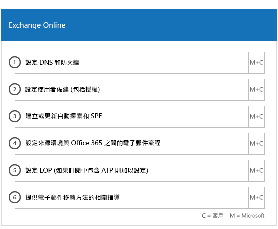

# 上架及移轉階段

Office 365 onboarding has four primary phases—Initiate, Assess, Remediate, and Enable. You can follow these phases with an optional data migration phase as shown in the following figure.
  

  
> [!NOTE]
>如需 Office 365 US Government 的上架和移轉詳細資訊，請參閱 [Office 365 US Government 的上架和移轉](US-Gov-appendix-onboarding-and-migration.md)。 

如需了解每個階段的詳細工作，請參閱 [FastTrack 責任](O365-fasttrack-responsibilities.md)和[您的責任](O365-your-responsibilities.md)。
  
## 起始階段

購買適當數量和類型的授權之後，請遵循購買確認電子郵件中的指示，將授權與您現有或新租用戶產生關聯。 
  
您可以透過 [Microsoft 365 系統管理中心](https://go.microsoft.com/fwlink/?linkid=2032704)或 [FastTrack 網站](https://go.microsoft.com/fwlink/?linkid=780698)取得協助。 

若要透過 [Microsoft 365 系統管理員中心](https://go.microsoft.com/fwlink/?linkid=2032704)取得協助，您的系統管理員需要登入至系統管理員中心，然後按一下 **[需要協助？]** Widget。 

若要透過 [FastTrack 網站](https://go.microsoft.com/fwlink/?linkid=780698)取得協助： 
1.    登入 [FastTrack 網站](https://go.microsoft.com/fwlink/?linkid=780698)。 
2.    從您的登陸頁面頂端的 [快速動作]**** 選取 [要求協助使用 Microsoft 365]****，或選取部署卡片上的 [要求協助使用 Microsoft 365]****。
3.    填妥 [要求協助使用 Microsoft 365]**** 表單。 
  
Partners can also get help through the [FastTrack site](https://go.microsoft.com/fwlink/?linkid=780698) on behalf of a customer. To do so:
1.    登入 [FastTrack 網站](https://go.microsoft.com/fwlink/?linkid=780698)。 
2.    選取 **[我的客戶]**。
3.    搜尋您的客戶或從客戶清單中選取他們。
4.    選取 [服務]****。
5.    填妥 [要求協助使用 Microsoft 365]**** 表單。

您也可以從租用戶的可用服務清單中的 FastTrack Center[FastTrack 網站](https://go.microsoft.com/fwlink/?linkid=780698)要求協助。 
    
During this phase, we discuss the onboarding process, verify your data, and set up a kickoff meeting. This includes working with you to understand how you intend to use the service and your organization's goals and plans to drive service usage.
  

  
## 評估階段

Your FastTrack Manager conducts an interactive success planning call with you and your adoption team. This introduces you to the capabilities of the eligible services you purchased, the key foundations you need for success, the methodology for driving usage of the service, and scenarios you can use to get value from the services. We assist you in success planning and provide feedback on key areas (as needed).
  
FastTrack Specialists work with you to assess your source environment and the requirements. We provide tools for you to gather data about your environment and  guide you through estimating bandwidth requirements and assessing your internet browsers, client operating systems, Domain Name System (DNS), network, infrastructure, and identity system to determine if any changes are required for onboarding. 
  
Based on your current setup, we provide a remediation plan that brings your source environment up to the minimum requirements for successful onboarding to Office 365 and, if needed, for successful mailbox and/or data migration. We provide a set of suggested activities to increase end user value and adoption. We also set up appropriate checkpoint calls for the Remediate phase.
  

  
## 修復階段

您將在來源環境中執行修復工作，使得您能夠符合將每項服務上架、採用和移轉需求。
  

  
We also provide a set of suggested activities to increase end user value and adoption. Before beginning the Enable phase, we jointly verify the outcomes of the remediation activities to make sure you're ready to proceed. 
  
在此階段，您的 FastTrack 專案經理會與您合作以設計出成功的規劃，引導您找到合適的資源與最佳作法，提供指引以利您提供服務給您的組織並促進服務之間的使用量。
  
## 啟用階段

當所有修復活動都完成時，焦點會進入設定服務取用的核心基礎結構、佈建 Office 365，以及處理活動來進行脲服務採用。 
  
## 核心

Core onboarding involves service provisioning and tenant and identity integration. It also includes steps for providing a foundation for onboarding services like Exchange Online, SharePoint Online, and Skype for Business Online. You and your FastTrack Manager continue to have success planning checkpoint meetings to evaluate progress against your goals and determine what further assistance you need.
  

  

  
> [!NOTE]
> WAP stands for Web Application Proxy. SSL stands for Secure Sockets Layer. SDS stands for School Data Sync. For more information on SDS, see [Welcome to Microsoft School Data Sync](https://go.microsoft.com/fwlink/?linkid=871480). 
  
將一或多個合格服務上架的動作可以從核心上架完成時開始。
  
## Exchange Online

For Exchange Online, we guide you through the process to get your organization ready to use email. The exact steps, depending on your source environment and your email migration plans, can include providing guidance for:
- 針對在 Office 365 中驗證的所有已啟用郵件的網域設定 Exchange Online Protection (EOP) 功能。
    > [!NOTE]
    > 您的郵件交換 (MX) 記錄必須指向 Office 365。 
- 設定 Office 365 進階威脅防護 (ATP) 功能 (如果它是您訂閱服務的一部分)。 如需詳細資訊，請參閱 [Office 365 進階威脅防護](#office-365-advanced-threat-protection)。
- Setting up the data loss prevention (DLP) feature for all mail-enabled domains validated in Office 365 as part of your subscription service. This is done once your MX records point to Office 365.
- Setting up Office 365 Message Encryption (OME) for all mail-enabled domains validated in Office 365 as part of your subscription service. This is done once your MX records point to Office 365.

> [!NOTE]
> 信箱複寫服務 (MRS) 會嘗試將您內部部署信箱中受資訊版權管理 (IRM) 的電子郵件移轉至對應的 Exchange Online 信箱。 在移轉之後，客戶必須將 Active Directory Rights Management Services (AD RMS) 範本複製到 Azure 版權管理服務 (Azure RMS)，才能讀取受保護的內容。

- 設定防火牆連接埠。
- 視需要設定 DNS、併入需要的自動探索、寄件者原則架構 (SPF) 和 MX 記錄。 
- 如果需要，則設定您的來源訊息環境與 Exchange Online 間的電子郵件流程。
- 進行從來源郵件環境到 Office 365 的郵件移轉。
- 設定信箱用戶端 (Outlook for Windows、Outlook 網頁版，以及 Outlook for iOS 和 Android)。
    > [!NOTE]
    > 如需有關郵件與資料移轉的詳細資訊，請參閱[資料移轉](O365-data-migration.md)。 
  

  
## SharePoint Online 和商務用 OneDrive

對於 SharePoint Online 和商務用 OneDrive，我們提供下列項目的指引：
- 設立 DNS。
- 設定防火牆連接埠。
- 佈建使用者和授權。   
- 設定 SharePoint 混合式功能，如混合式搜尋、混合式網站、混合式分類、內容類型、混合式自助網站架設 (僅限 SharePoint Server 2013)、擴充的應用程式啟動器、混合式商務用 OneDrive，以及外部網路網站。
    
FastTrack 專家會提供將資料移轉到 Office 365 的指引，方法是使用工具和文件組合，以及在適用且可行的情況下執行設定工作。
  

  
## 商務用 OneDrive

對於商務用 OneDrive，步驟將視您目前是否使用 SharePoint 而定，若有使用，則視您使用的版本。 
  

  
## Office 365 進階威脅防護

對於 Office 365 ATP，我們提供下列作業的指引：
- 啟用安全連結、安全附件和防網路釣魚。 
- 設定自動化、調查和回應。
- 使用攻擊模擬器。
- 報告和威脅分析。

## Microsoft 資訊管控

針對 Microsoft 資訊管控，我們提供以下指示：

- 資訊管控。
- 保留標籤和原則。
- 記錄管理。
- 刪除原則。
- 通訊合規性。
- 測試人員風險管理 
- 進階電子文件探索。

## Microsoft 資訊保護

針對 Microsoft 資訊保護，我們提供以下指示：
- 透過內容總管和活動總管瞭解您的資料。
- 敏感度標籤。
- 資料分類。
- Microsoft Teams 聊天和頻道的外洩防護（DLP）原則。
- 資訊保護。
- 統一標籤。

## Microsoft Teams

對於 Microsoft Teams，我們提供下列項目的指引：
- 確認最低需求。  
- 設定防火牆連接埠。   
- 設立 DNS。 
- 確認您的 Office 365 租用戶上已啟用 Microsoft Teams。  
- 啟用或停用使用者授權。
    

## 商務用 Skype Online

對於商務用 Skype Online，我們提供下列項目的指引：
- 設定防火牆連接埠。
- 設立 DNS。   
- 建立任何會議室系統裝置的帳戶。   
- 部署支援的 商務用 Skype Online 用戶端。  
- 在您的內部部署 Lync 2010、Lync 2013 或 商務用 Skype 2015 伺服器環境與商務用 Skype Online 租用戶 (如果適用)、通話方案、Skype 會議廣播，以及電話系統和通話方案 (在可用的市場) 之間建立分割網域伺服器組態。
    

  

  
## Power BI

對於 Power BI，我們提供下列項目的指引： 
- 指派 Power BI 的授權。
- 部署 Power BI Desktop 應用程式。
    
## Microsoft Project Online

對於 Microsoft Project Online，我們提供下列項目的指引：
  
- 確認 Microsoft Project Online 依賴的基本 SharePoint 功能。   
- 將 Microsoft Project Online 服務新增到您的租用戶中 (包括新增使用者的訂閱)。  
- 設定企業資源資料庫​​ (ERP)。 
- 建立您的第一個專案。 
    

  
## Microsoft Project Online 專業版和 Microsoft Project Online 進階版

對於 Microsoft Project Online 專業版和 Microsoft Project Online 進階版，我們提供下列項目的指引：
- 解決部署問題。
- 使用 [Microsoft 365 系統管理中心](https://go.microsoft.com/fwlink/?linkid=2032704)和 Windows PowerShell 指派使用者授權。  
- 使用隨選即用從 Office 365 入口網站安裝 Project Online 桌面用戶端。
- 使用 Office 365 部署工具來設定更新設定。  
- 設定 Project Online 桌面用戶端的單一內部網站發佈伺服器，包含建立搭配 Office 365 部署工具使用之 configuration.xml 檔案的相關協助。  
- 正在將 Project Online 桌面用戶端連線至 Project Online 專業版或 Project Online 進階版。
    

  
## Yammer Enterprise

對於 Yammer Enterprise，我們提供啟用 Yammer Enterprise 服務的指引。
  
## Microsoft 365 Apps

針對 Microsoft 365 Apps，我們提供以下指引︰
- 解決部署問題。   
- 使用 [Microsoft 365 系統管理中心](https://go.microsoft.com/fwlink/?linkid=2032704)和 Windows PowerShell 指派以使用者和以裝置為基礎的授權。 
- 使用隨選即用從 Office 365 入口網站安裝 Microsoft 365 Apps。   
- 在 iOS 或 Android 裝置上安裝 Office Mobile 應用程式 (如 Outlook Mobile、Word Mobile、Excel Mobile 和 PowerPoint Mobile)。   
- 使用 Office 365 部署工具來設定更新設定。   
- 本地或雲端安裝的選取項目和設定。 
- 使用 Office 自訂工具或原生 XML 建立 Office 部署工具，以設定部署套件。  
- 使用 Microsoft Endpoint Configuration Manager 部署，包含協助建立 Microsoft Endpoint Configuration Manager 套件。
    

  
## Outlook for iOS 和 Android

若為 Outlook for iOS 和 Android，我們提供下列指引：
- 從 Apple App Store 和 Google Play 下載 Outlook for iOS 和 Android。
- 設定帳戶並存取 Exchange Online 信箱。
