# Office 365 美國政府的上架和遷移階段

Office 365 上架有四個主要階段 - 起始、評估、修復與啟用。您可以在這些階段後面選擇接著資料移轉階段，如下圖所示。
  
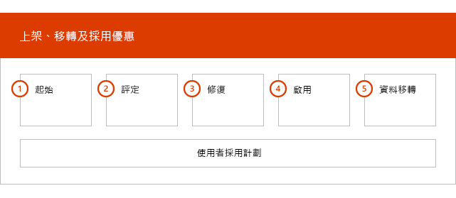
  
如需每個階段的詳細工作，請參閱 office [365 Us 政府的 FastTrack 責任](US-Gov-appendix-fasttrack-responsibilities.md)和[您 Office 365 Us 政府的責任](US-Gov-appendix-your-responsibilities.md)。
  
## 起始階段

購買適當數量和類型的授權之後，請遵循購買確認電子郵件中的指示，將授權與您現有或新租用戶產生關聯。 
  
您可以透過 [Microsoft 365 系統管理中心](https://go.microsoft.com/fwlink/?linkid=2032704)或 [FastTrack 網站](https://go.microsoft.com/fwlink/?linkid=780698)取得協助。 
 
若要透過 [Microsoft 365 系統管理員中心](https://go.microsoft.com/fwlink/?linkid=2032704)取得協助，您的系統管理員需要登入至系統管理員中心，然後按一下 **[需要協助？]** Widget。 

若要透過 [FastTrack 網站](https://go.microsoft.com/fwlink/?linkid=780698)取得協助： 
1.    登入 [FastTrack 網站](https://go.microsoft.com/fwlink/?linkid=780698)。 
2.    從登陸頁面頂端的 [**快速動作**] 或選取 [部署卡片上的**Microsoft 365 的要求協助**] 中，選取 [**要求 microsoft 365 的協助]。**
3. 填妥 [要求協助使用 Microsoft 365]**** 表單。 

合作夥伴也可以透過 [FastTrack 網站](https://go.microsoft.com/fwlink/?linkid=780698)代表客戶取得協助。作法如下：
1.    登入 [FastTrack 網站](https://go.microsoft.com/fwlink/?linkid=780698)。 
2.    選取 **[我的客戶]**。
3.    搜尋您的客戶或從客戶清單中選取他們。
4.    選取 [服務]****。
5.    填妥 [要求協助使用 Microsoft 365]**** 表單。   

您也可以從租用戶的可用服務清單中的 FastTrack Center[FastTrack 網站](https://go.microsoft.com/fwlink/?linkid=780698)要求協助。 
    
在這個階段期間，我們將討論上架程序、驗證資料並設定啟動會議。
  
這包括與您合作以了解您要如何使用服務以及您的組織為了促進服務使用量所提出的目標和計劃。
  
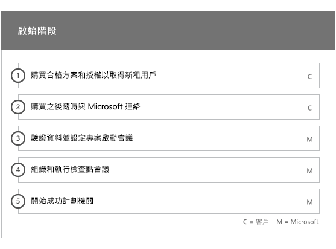
  
## 評估階段

您的 FastTrack 專案經理會透過電話與您和您的採用小組針對如何做出成功的規劃進行互動討論。在討論過程中，他會為您介紹您購買的合格服務的功能、讓計劃成功所需的關鍵基礎、促進服務使用量的方法，以及您可以用來獲取服務價值的案例。我們會協助您做出成功的規劃，並 (視需要) 就關鍵領域提供意見。
  
FastTrack 專家會與您一起評估您的來源環境和需求。 我們為您提供工具，以收集有關您環境的資料，並引導您評估頻寬需求，以及評估 internet 瀏覽器、用戶端作業系統、網域名稱系統（DNS）、網路、基礎結構和身分識別系統，以判斷上架是否需要進行任何變更。 
  
根據您目前的設定，我們將提供修復方案，該方案最高可將您的來源環境帶至成功上架為 Office 365 的最低系統需求，以及成功進行信箱和/或資料移轉 (如果需要)。我們會提供一組建議活動來增加使用者價值和採用率。我們也將對修復階段設定適當的檢查點通話。
  
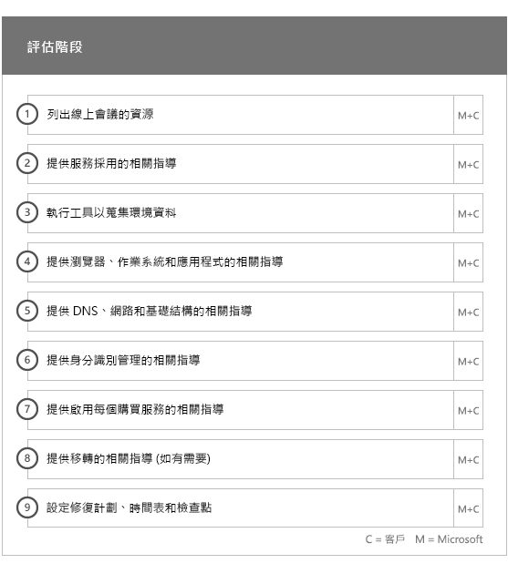
  
## 修復階段

您將在來源環境中執行修復工作，使得您能夠符合將每項服務上架、採用和移轉需求。
  
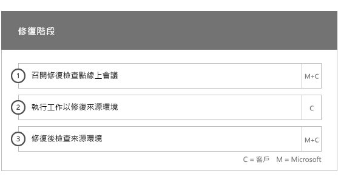
  
我們也會提供一組建議活動來增加使用者價值和採用率。開始「啟用」階段之前，我們會一起驗證修復活動的成果，以確定您已準備就緒可繼續進行。 
  
在此階段，您的 FastTrack 專案經理會與您合作以設計出成功的規劃，引導您找到合適的資源與最佳作法，提供指引以利您提供服務給您的組織並促進服務之間的使用量。
  
## 啟用階段

當所有修復活動都完成時，焦點會進入設定服務取用的核心基礎結構、佈建 Office 365，以及處理活動來進行脲服務採用。 
  
## 核心

核心上架包括服務佈建和租用戶與身分識別整合。它還包括提供基礎以讓 Exchange Online、SharePoint Online 和 商務用 Skype Online 等服務上架的步驟。您和您的 FastTrack 專案經理仍會舉行成功規劃檢查點會議，以評估目標進度並判斷您需要哪些進一步的協助。
  
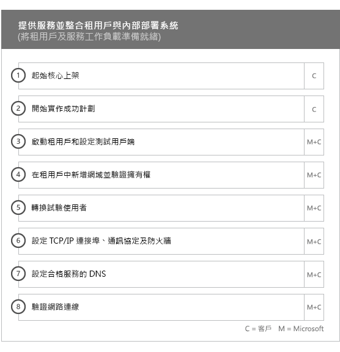
  
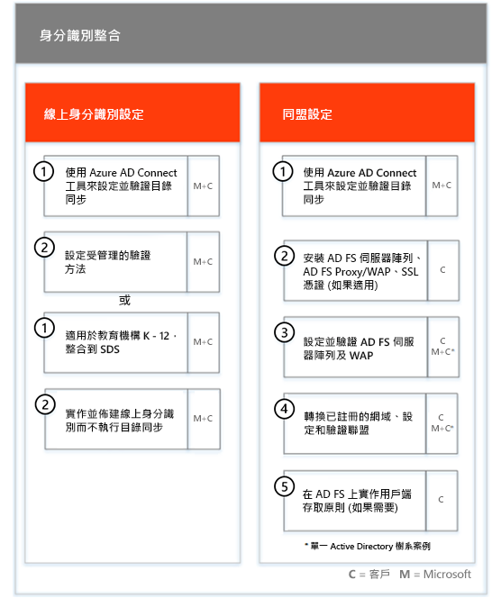
  
> [!NOTE]
> WAP 代表 Web 應用程式 Proxy。SSL 代表安全通訊端層。SDS 代表學校資料同步處理。有關 SDS 的詳細資訊，請參閱[歡迎使用 Microsoft 學校資料同步處理](https://go.microsoft.com/fwlink/?linkid=871480)。 
  
將一或多個合格服務上架的動作可以從核心上架完成時開始。
  
## Exchange Online

對於 Exchange Online，我們將引導您讓組織準備好使用電子郵件的程序。確切步驟因您的來源環境和電子郵件移轉方案有所不同，可能包含提供下列項目的指引：
  
- 針對在 Office 365 中驗證的所有已啟用郵件的網域設定 Exchange Online Protection (EOP) 功能。   
    > [!NOTE]
    > 您的郵件交換 (MX) 記錄必須指向 Office 365。   
- 設定 Exchange Online 進階威脅防護 (ATP) 功能，如果它在您的 MX 記錄指向 Office 365 之後是訂閱服務的一部分。這項功能設定為 Exchange Online Protection 反惡意程式碼設定的一部分。   
- 設定防火牆連接埠。   
- 視需要設定 DNS、併入需要的自動探索、寄件者原則架構 (SPF) 和 MX 記錄。     
- 如果需要，則設定您的來源訊息環境與 Exchange Online 間的電子郵件流程。   
- 進行從來源郵件環境到 Office 365 的郵件移轉。   
    > [!NOTE]
    > 如需有關郵件與資料移轉的詳細資訊，請參閱[資料移轉](O365-data-migration.md)。 
  
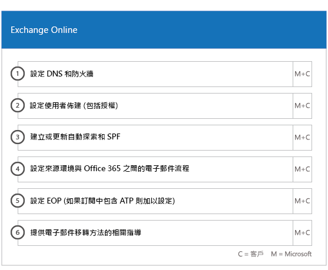
  
## SharePoint Online 和商務用 OneDrive

對於 SharePoint Online 和商務用 OneDrive，我們提供下列項目的指引： 
- 設立 DNS。   
- 設定防火牆連接埠。   
- 佈建使用者和授權。   
- 設定 SharePoint 混合式功能，如混合式搜尋、混合式網站、混合式分類、內容類型、混合式自助網站架設 (僅限 SharePoint Server 2013)、擴充的應用程式啟動器、混合式商務用 OneDrive，以及外部網路網站。
    
FastTrack 專家會提供將資料移轉到 Office 365 的指引，方法是使用工具和文件組合，以及在適用且可行的情況下執行設定工作。
  
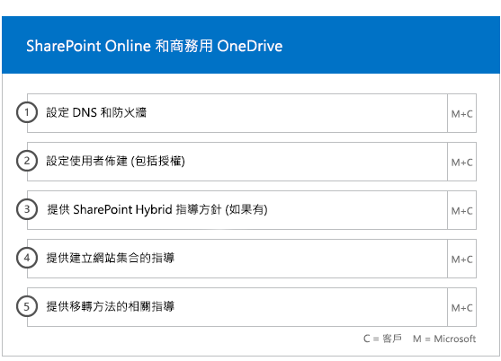
  
## 商務用 OneDrive

對於商務用 OneDrive，步驟將視您目前是否使用 SharePoint 而定，若有使用，則視您使用的版本。 
  
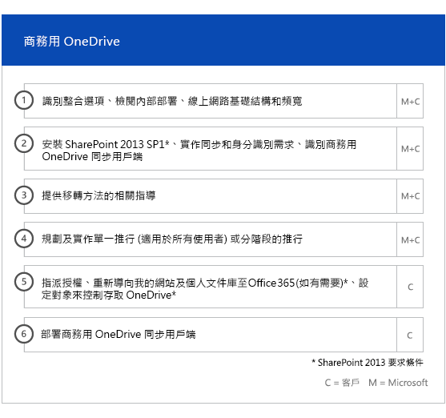
  
## 商務用 Skype Online

對於商務用 Skype Online，我們提供下列項目的指引： 
- 設定防火牆連接埠。    
- 設立 DNS。    
- 建立任何會議室系統裝置的帳戶。    
- 部署支援的 商務用 Skype Online 用戶端。   
- 在您的內部部署 Lync 2010、Lync 2013 或商務用 Skype 2015 伺服器環境和商務用 Skype Online 租使用者之間建立分割域伺服器設定（如果適用）。
- 啟用通話方案、Skype 會議廣播和電話系統和通話方案（在可用的市場中–無法在 GCC 高或 DoD 方案中使用）。 
    
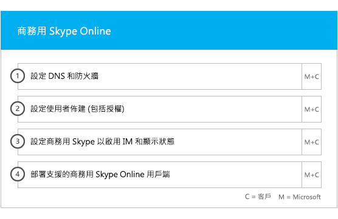
  
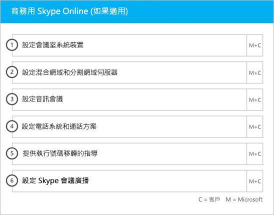
  
## Microsoft Teams

> [!NOTE]
> 在 GCC 高或 DoD 方案中無法使用下列各項。

對於 Microsoft Teams，我們提供下列項目的指引： 
- 確認最低需求。   
- 設定防火牆連接埠。   
- 設立 DNS。  
- 確認您的 Office 365 租用戶上已啟用 Microsoft Teams。    
- 啟用或停用使用者授權。
    
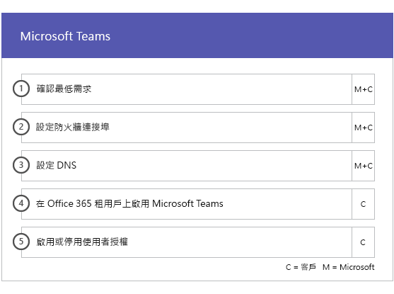
  
## Power BI

對於 Power BI，我們提供下列項目的指引：  
- 指派 Power BI 的授權。    
- 部署 Power BI Desktop 應用程式。   
## Microsoft Project Online

對於 Microsoft Project Online，我們提供下列項目的指引： 
- 確認 Microsoft Project Online 依賴的基本 SharePoint 功能。    
- 將 Microsoft Project Online 服務新增到您的租用戶中 (包括新增使用者的訂閱)。    
- 設定企業資源資料庫​​ (ERP)。   
- 建立您的第一個專案。 
    
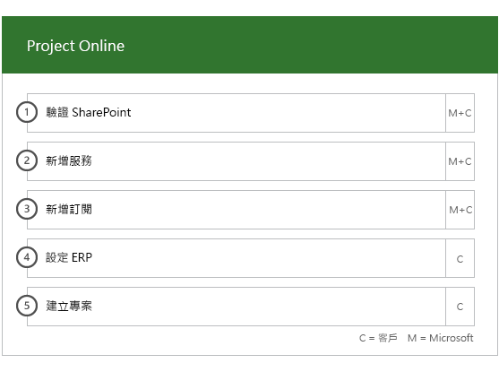
  
## Yammer Enterprise

對於 Yammer Enterprise，我們提供啟用 Yammer Enterprise 服務的指引。

> [!NOTE]
> Yammer Enterprise 不是 Office 365 美國政府的元件，但可免費提供給在 GCC 中為 Office 365 授權的每位使用者提供的獨立功能。 這項優惠目前僅限於以企業合約和企業訂閱協定購買 Office 365 GCC 的客戶。 在 GCC 高或 DoD 方案中無法使用 Yammer。 
  
## Microsoft 365 Apps

針對 Microsoft 365 Apps，我們提供以下指引︰ 
- 解決部署問題。    
- 使用 [Microsoft 365 系統管理中心](https://go.microsoft.com/fwlink/?linkid=2032704)和 Windows PowerShell 指派使用者授權。    
- 使用隨選即用從 Office 365 入口網站安裝 Microsoft 365 Apps。    
- 在 iOS 或 Android 裝置上安裝 Office Mobile 應用程式 (如 Outlook Mobile、Word Mobile、Excel Mobile 和 PowerPoint Mobile)。   
- 使用 Office 365 部署工具來設定更新設定。    
- 設定 Microsoft 365 應用程式的單一內部網站發佈伺服器，包含建立 configuration.xml 檔案的協助，以搭配 Office 365 部署工具使用。    
- 使用 Microsoft Endpoint Configuration Manager 部署，包含協助建立 Microsoft Endpoint Configuration Manager 套件。
    

