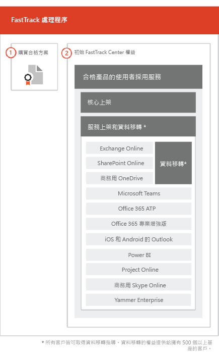

# FastTrack 處理程序The FastTrack Process

FastTrack 程序提供上架和使用者採用服務。The FastTrack process provides onboarding and user adoption services. 
  
上架包含︰Onboarding consists of:
  
- 核心上架\*\*  意指租用戶組態和與 Azure Active Directory (Azure AD) 整合 (若有需要) 所需的工作。核心上架也能成為將其他合格之服務上架的基準。*Core onboarding* — These are tasks required for tenant configuration and integration with Azure Active Directory (Azure AD) if needed. Core onboarding also provides the baseline for onboarding other eligible services. 
- 服務上架和移轉\*\* - 服務上架工作會啟用您租用戶中的案例。[資料移轉](data-migration.md)中涵蓋資料移轉 (包括電子郵件和檔案)。*Service onboarding and migration* — Service onboarding tasks enable scenarios in your tenant. Data migration (including email and files) is covered in [Data Migration](data-migration.md). 
    
使用者採用服務由數項工作所組成，提供您指引以確保您的使用者知道適合的服務，並用來促進商業價值。User adoption services are comprised of tasks that provide guidance for you to ensure your users are aware of the eligible services and can use them to drive business value. This assistance occurs in parallel to onboarding activities.
  
> [!NOTE]
> FastTrack 提供客戶建議的方法、指引和最佳作法，設計用來提供快速且可預測的結果。如果您選擇在本指南之外部署，您的上架體驗和服務使用方式可能會受到影響。指引是指口頭協助和書面協助的組合。當 FastTrack 專家提供指引時，FastTrack 人員便無法代替您作業。只要有最新的訂閱，您就可以使用 FastTrack 服務上架並採用任何合格的產品工作負載。FastTrack provides customers with a recommended approach, guidance, and best practices engineered to deliver quick and predictable outcomes. If you choose to deploy outside of this guidance, your onboarding experience and usage of the service may be impacted. Guidance is defined as a combination of verbal and written assistance. When FastTrack Specialists provide guidance, FastTrack personnel cannot act on your behalf. You can use FastTrack services to onboard and adopt any qualifying product workload as long as your subscription is current. 
  
## 上架程序The onboarding process

下圖說明上架程序。The following diagram illustrates the onboarding process.
  

  
您可以透過 Office 365 系統管理員中心或 [FastTrack 網站](https://go.microsoft.com/fwlink/?linkid=780698)取得協助。若要透過 Office 365 系統管理員中心取得協助，您的系統管理員需要登入至系統管理員中心，然後按一下 [需要協助？]\*\*\*\* 小工具。若要透過 [FastTrack 網站](https://go.microsoft.com/fwlink/?linkid=780698)取得協助，請在登入後按一下 [服務] \*\*\*\*，並填妥 [要求 Office 365 的協助]\*\*\*\* 表單。You can get help through the Office 365 admin center or the [FastTrack site](https://go.microsoft.com/fwlink/?linkid=780698). To get help through the Office 365 admin center, your admin signs into the admin center and then clicks the **Need help?** widget. To get help through the [FastTrack site](https://go.microsoft.com/fwlink/?linkid=780698), sign in, click **Services**, and complete the **Request Assistance for Office 365** form. 
    
> [!NOTE]
>  如果您有合作夥伴列在您的 Office 365 租用戶中，您將看不到這個選項。請洽詢您的合作夥伴，以取得協助。If you have a partner listed in your Office 365 tenant, you won't see this option. Please consult your partner for assistance. 
  
 您也可以從租用戶的可用服務清單中的 [FastTrack 網站](https://go.microsoft.com/fwlink/?linkid=780698) 要求 FastTrack Center 協助。You can also ask for FastTrack Center help from the [FastTrack site](https://go.microsoft.com/fwlink/?linkid=780698) in the list of available services for your tenant. 
    
 一旦上架協助啟動，我們將設定線上會議的排程。Once onboarding assistance starts, we set up a schedule of online meetings.
    
合作夥伴也可以透過 代表客戶取得協助若要這樣做，合作夥伴登入網站後，請選取客戶記錄並按一下 [服務]\*\*\*\*，然後填妥 [要求 Office 365 的協助]\*\*\*\* 表單。Partners can also get help through the [FastTrack site](https://go.microsoft.com/fwlink/?linkid=780698) on behalf of a customer. To do so, the partner signs in to the site, selects the customer record, clicks **Services**, and completes the **Request Assistance for Office 365** form. 

下表列出該程序的角色與責任。The following table lists roles and responsibilities for the process.
    
|||
|:-----|:-----|
|**角色****Role**   |**責任****Responsibility**   |
|**FastTrack 專家****FastTrack Specialist**   |在遠端提供所有上架、移轉以及使用者採用服務。Microsoft provides all onboarding, migration, and user adoption services remotely by assigned Microsoft personnel.    將使用工具和發行的說明文件組合，從遠端協助您。Microsoft assists you remotely by using a combination of tools and published documentation.   直接與您或您的代表配合。Microsoft can work directly with you or your representative.   提供電子郵件與資料移轉指導。Microsoft provides email and data migration guidance.|
|**FastTrack Center****FastTrack Center**    |提供指引，以利核心和服務上架以及規劃成功的合格服務採用。The FastTrack team provides guidance with core and service onboarding and planning successful adoption of eligible services.    提供協助，並且是在指定地區的一般上班時段提供。The FastTrack_Center provides assistance and is available during normal business hours for a given region.   以下列語言提供協助：繁體中文和簡體中文 (僅限說中文的資源)、英文、法文、德文、義大利文、日文、韓文、葡萄牙文 (巴西)、西班牙文、泰文以及越南文。Assistance is available in Traditional Chinese and Simplified Chinese (resources speak Mandarin only), English, French, German, Italian, Japanese, Korean, Portuguese (Brazil), Spanish, Thai, and Vietnamese.|

  

